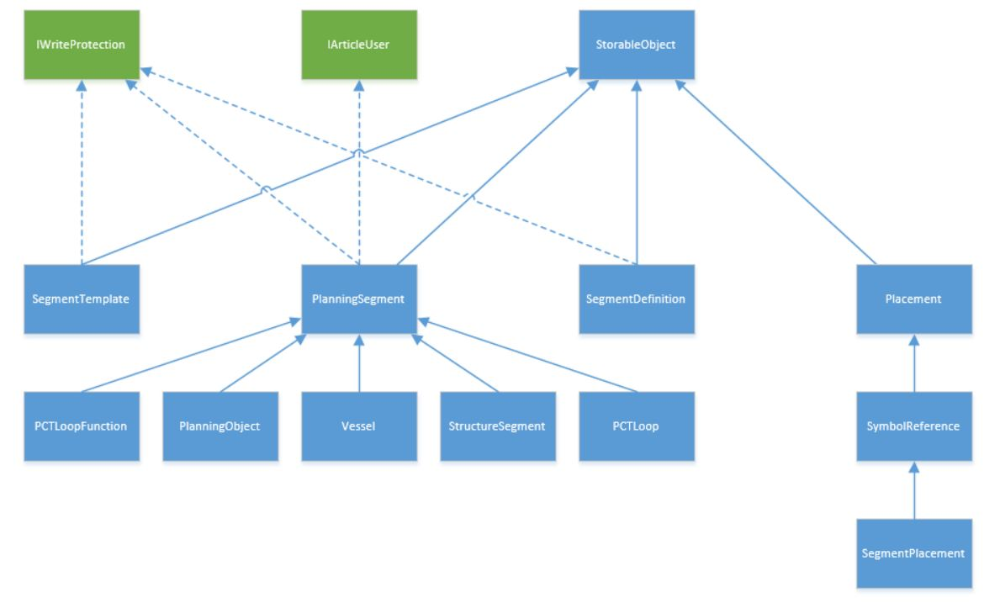

# API Pre-planning

EPLAN API provides now full access to Pre-planning data. Following enhancements were created for this purpose:

- project-related classes from `Eplan.EplApi.DataModel.Planning namespace`
- `PrePlanningMacro` class and `Insert::PrePlanning` for the macro access
- `PrePlanningService` for more complex operations

- new enum values

###  Eplan.EplApi.DataModel.Planning namespace

Pre-Planning related objects are stored in `Eplan.EplApi.DataModel.Planning namespace`. Here is an UML class diagram which shows their inheritance hierarchy:

###  Migration of PPE API to Preplanning

Since EPLAN 2.4, there is a new product for the pre-planning and basic engineering of plant and machinery:

**EPLAN Preplanning Professional**

The product was developed on the basis of the EPLAN Platform and in parallel to the EPLAN PPE solution. Now it is the replacement of the EPLAN PPE.

Because of this, EPLAN PPE is no longer supported nor described in API Help since version 2.7. So please migrate your applications using PPE API to Preplanning API.

As a replacement, use classes from `Eplan.EplApi.DataModel.Planning namespace` and PrePlanningService.

Please note also, there will be no further development of the EPLAN PPE system.

See Also

#### Reference

[Eplan.EplApi.DataModel.Planning Namespace](Eplan.EplApi.DataModelu~Eplan.EplApi.DataModel.Planning_namespace.md)
