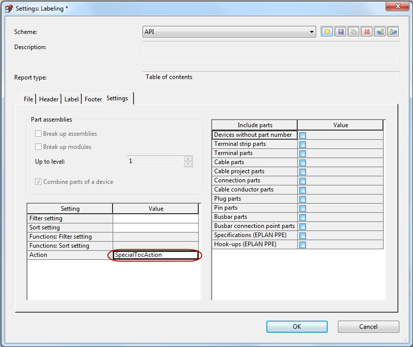
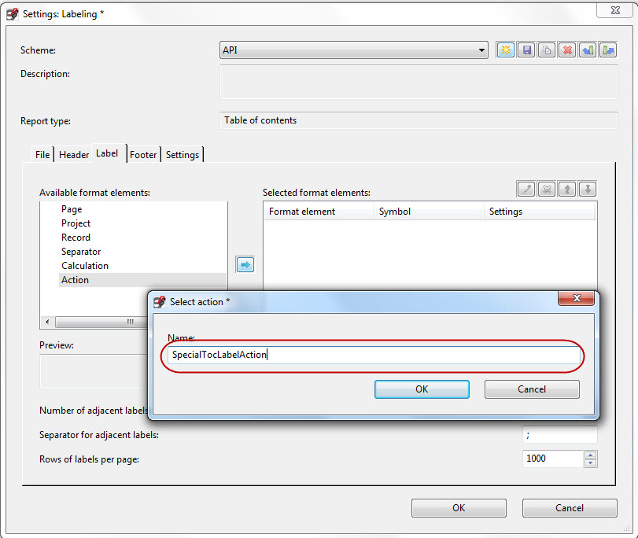

# API Labeling Modification Interface

The API Labeling Modification Interface makes it possible to take influence on the result of label generation via API.

Following points need to be done to use it in an API program:

### a) Create labeling scheme settings Action

Any labeling scheme now contains a property, where you can set a name of an action :

If an action by this name is registered in EPLAN, it is called during label generation.

With the action, you can influence the objects, which are reported and the order in which they appear.

The action from template will be called with following parameters:

Parameters:

[in] "project" value: id of a project

[in] "mode" value: "ModifyObjectList"

[in /out] "objects" value: Ids of objects that will be evaluated separated with semicolon.

This list can be modified (not the objects themselves!). You can add or remove object ids from the list or change their order in the list.

### b) Create label texts processing action

You can now add an action to a label:

This action will be called, when the label is created. The action is called with the following parameters:

[in] "objects" value: main object for the line (can be more than one).

[out]: Call `SetStrings()` of the calling context to set the result text. More than one result text will generate new lines.

Please set only one string in the string array you pass to `SetStrings()`.

Line breaks are always written to the output file as they are in the string. If necessary, remove line breaks from the strings.
