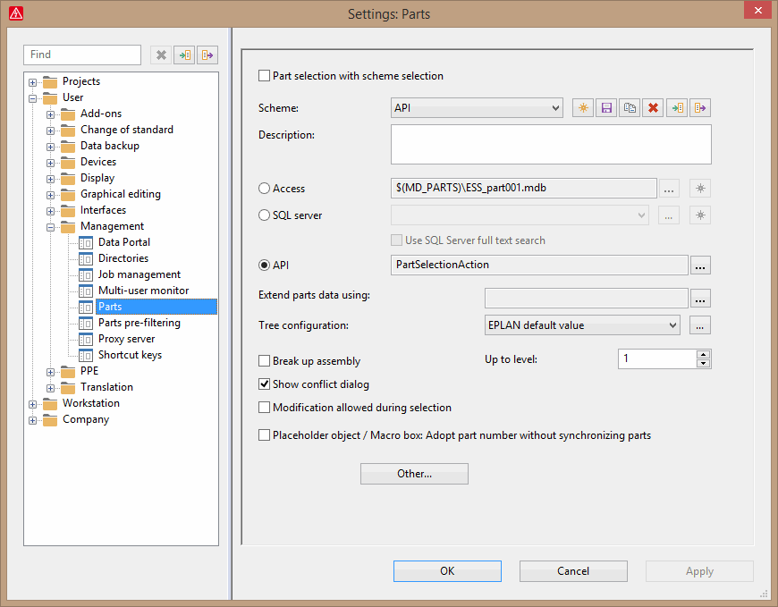
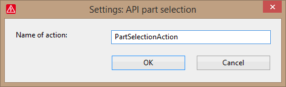
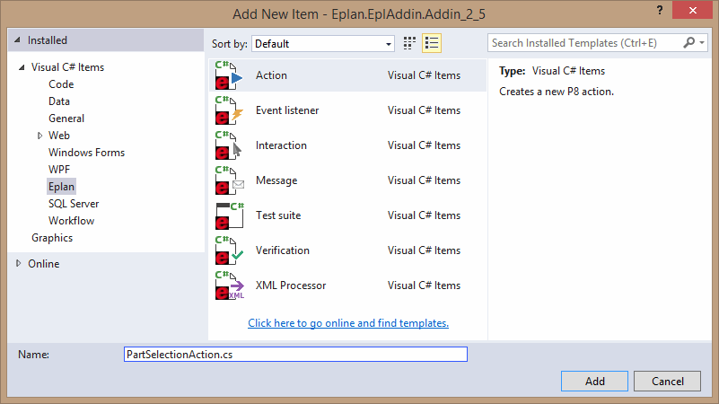

# API Parts Selection Interface

In EPLAN you have the possibility to switch between different data sources for part selection. You can get parts data via:

  * MS Access
  * SQL Server
  * via API

Setting data source as API means that an API action will be called in case of operations related to accessing parts , for example:

- new part (or reference) is added to a project

- part reference is changed in a project

- part information is loaded from system

- part is synchronized to a project

- new macro with parts is inserted to a project

- new device is inserted to project

- new device is selected (with device section)

- new device list item is inserted to project

This way user a can create its own dialog for setting parts data, can set additional properties when selecting a part , etc.

Example of its usage is 'EPLAN Data Portal' scheme - after setting it, standard dialog for selecting parts is replaced with another one allowing enhanced selection of parts from Data Portal database.

Please be aware that API Parts Selection cannot completely substitute parts management databases such as Access or SQL Server. In some operations it still has to be used.

This topic describes, how to use the API Parts Selection interface.

### a) Setting API parts selection action

To use the API parts selection interface, you first have to enable and configure it. Therefore you open the settings dialog in EPLAN and select "User>Management>Parts" . In this dialog you create a new scheme and activate the radio button "API".



By clicking the ellipsis [...] button beside „API“ you can open a dialog with further settings for the API interface.



In this dialog you enter the name of an API action, which will be called by EPLAN, when the parts selection is started.

Bellow it is described how to develop the action and set its parameters

### b) Creating action

Please create an action with a name that was set in Settings dialog. The best way is to use Visual Studio wizard:



### c) Handling action parameters

The part data is transmitted through the ActionCallingContext of the action. The objects contains a set of input and output parameters passed as strings

=== "C#"

    ```csharp
    public bool Execute(ActionCallingContext oActionCallingContext)
    ```

=== "VB"

    ```vb
        Public Function Execute(oActionCallingContext As Eplan.EplApi.ApplicationFramework.ActionCallingContext) As Boolean _
            Implements Eplan.EplApi.ApplicationFramework.IEplAction.Execute
    ```

This way it is possible to have an access to properties of a selected part, for example :

```csharp
string sMode = "";
ctx.GetParameter("Modus", ref sMode);
string sProp00 = "(int)Properties.Article.ARTICLE_DEPTH + sSeparator + "1";
ctx.AddParameter(sProp00, "44.0");
```

The parameter "Modus" is used to identify the mode in which parts selection is called. It can have one of the following values:

  * "Selection" - a part is selected.
  * "Read" - a part is updated
  * “Create” - a part is created and parts selection action is called as alternative parts data source
  * “Exist” - check if part exist

**Here is also a table with other input parameters:**

Mode ("Modus" parameter)  |  Input parameters  

---|--- 

Selection  |  objectid - the object Id of the function is transmitted on which the part selection was started. With help of the object Id, you can locate the function in the project and get additional information about it 

separator – contains separator between property number and part index in parameter name 

SingleSelection - is set to "1", in case only one part may be set. Otherwise, it is "0" or an empty string. 

ForceNoResolve - is set to "1", if the assembly should not be resolved. Otherwise, it is "0" or an empty string. 

GraphicalPreview - is set to "1", if the user wishes a preview of the part. Otherwise, it is "0" or an empty string. 

preselectpartnr - contains the part number in the table cell from which the part selection is started. If the cell is empty, the parameter contains an empty string. 

preselectvariant - contains the part variant number in the table cell from which the part selection is started. 

PartSelection - is set to "1", if only a selection dialog should be shown. Otherwise, it is "0", the parts can also be edited. 

DatabaseId - `StorableObject.DatabaseIdentifier` of the current project 

UsePreSelection - is set to "1", if the pre selection list should be taken into account. Otherwise, it is "0" or an empty string. 

codeletter - 'Identifier' property of selected symbol 

symbollib - symbol library of selected symbol 

symbolnr - symbol number of selected symbol 

craft - trade number of selected part 

_cmdline - name of calling action  

Read  |  Separator – contains separator between property number and part index in parameter name, for example 

<property number><separator><part index>[<separator><property index>] - e.g. "22001_1", value “SIE.5SX2102-8” 

22024_<part index> - part variant 

_cmdline - name of calling action  

Create  |  Separator – contains separator between property number and part index in parameter name 

<property number><separator><part index>[<separator><property index>] - e.g. "22001_1", value “SIE.5SX2102-8” 

_cmdline - name of calling action  

Exist | Separator – contains separator between property number and part index in parameter name, for example 

<property number><separator><part index>[<separator><property index>] - e.g. "22001_1", value “SIE.5SX2102-8” 

22024_<part index> - part variant 

_cmdline - name of calling action  

 

**The output parameters are following:**

- the property to set. Parameter name has format : <property number><separator><part index>[<separator><property index>] . It is required to set part number property (22001), another properties are optional. The <part index> is used to pass more than one part simultaneously. It starts from 1. Example : "1234_1" . As a value it can be any any string for example “11.0”, etc

- count of parts to transmit. Parameter name is "count", value is determined by the last <part index>

- in case of 'Exists' mode, there is also 'Result' parameter which determines whether a part exists

Important input parameter is the object ID ("objectid"). With help of the object id, you can locate the function in the project and get additional information about it.

The following example shows an API parts selection action in which a user dialog "FormPartSelection" is shown and the fields Partnumber, Typenumber, and Description1 are transmitted.

```csharp
public class MyPartSelectionAction : IEplAction
{
    public bool Execute(ActionCallingContext oActionCallingContext)
    {
        // objectId, where part selection is started from
        string sObjectId = "";
        oActionCallingContext.GetParameter("ObjectId", ref sObjectId);
        // get Function object
        Function oFunction = getFunction(sObjectId);
        FormPartSelection frm = new FormPartSelection();
        frm.Description = "";
        frm.Typenumber = "";
        frm.Partnumber = "new part";
        // start part selection dialog
        if (frm.ShowDialog() == DialogResult.OK)
        {
            string sTypenumber = frm.Typenumber;
            string sPartnumber = frm.Partnumber;
            string sDescription = frm.Description;
            // count of parts
            oActionCallingContext.addParameter("count", "1");
            // get separator between property and index
            string sSeparator = "";
            oActionCallingContext.GetParameter("Separator", ref sSeparator);
            int prop;
            int idx = 1;
            string sProp;
            // set part number
            prop = (int)Properties.Article.ARTICLE_PARTNR;
            sProp = prop.ToString() + sSeparator + idx.ToString();
            oActionCallingContext.AddParameter(sProp, sPartnumber);
            // set type number
            prop = (int)Properties.Article.ARTICLE_TYPENR;
            sProp = prop.ToString() + sSeparator + idx.ToString();
            oActionCallingContext.AddParameter(sProp, sTypenumber);
            // set description 1
            prop = (int)Properties.Article.ARTICLE_DESCR1;
            sProp = prop.ToString() + sSeparator + idx.ToString();
            oActionCallingContext.AddParameter(sProp, sDescription);
            if ((oFunction != null))
            {
               string strArticleCharacteristics = (int)Properties.Article.ARTICLE_CHARACTERISTICS + sSeparator + "1";
               ctx.AddParameter(strArticleCharacteristics, "5,5kW");      //set characteristics to 5,5 kW
            }
        }
        return true;
    }
    // locate the function by its object id
        private Function getFunction(string sObjectId)
        {
            ProjectManager projectManager = new ProjectManager();
            Project project = projectManager.CurrentProject;
            DMObjectsFinder objectFinder = new DMObjectsFinder(project);
            FunctionPropertyList functionPropertyList = new FunctionPropertyList();
            functionPropertyList[Properties.StorableObject.PROPUSER_DBOBJECTID] = sObjectId;
            FunctionsFilter functionsFilter = new FunctionsFilter();
            functionsFilter.SetFilteredPropertyList(functionPropertyList);
            Function[] aFunction = objectFinder.GetFunctions(functionsFilter);
            if (aFunction.Length > 0)
            {
                return aFunction[0];
            }
            return null;
        }

    public bool OnRegister(ref string Name, ref int Ordinal)
    {
        Name = "MyPartSelectionAction";
        Ordinal = 20;
        return true;
    }
    public MyPartSelectionAction()
    {}
}
```

