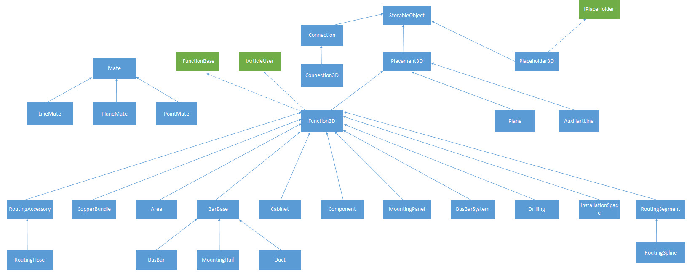

# API Pro Panel

EPLAN API gives currently user access to EPLAN Pro Panel objects. Generally every functionality that can be done from user interface, is also available in API Pro Panel. 

The chapter gives user an overview about how to use API objects in EPLAN Pro Panel. Following pages shows how to create particular objects and how do they look in GUI. 

Basics 

API Pro Panel was created as an extension to standard API DataModel (Eplan.EplApi.DataModelu.dll assembly). 

So there is a new namespace Eplan:EplApi:DataModel:E3D for 3d classes and HEServices methods that operates on them. 

Usually it is enough to have Eplan Electric P8 to use API Pro Panel. Some methods/properties however may require EPLAN Pro Panel to be installed with corresponding license. 

UML class diagram 

The graph below shows hierarchy of the most important classes in Pro Panel API 

See Also

#### Reference

[Eplan.EplApi.DataModel.E3D Namespace](Eplan.EplApi.DataModelu~Eplan.EplApi.DataModel.E3D_namespace.html)
