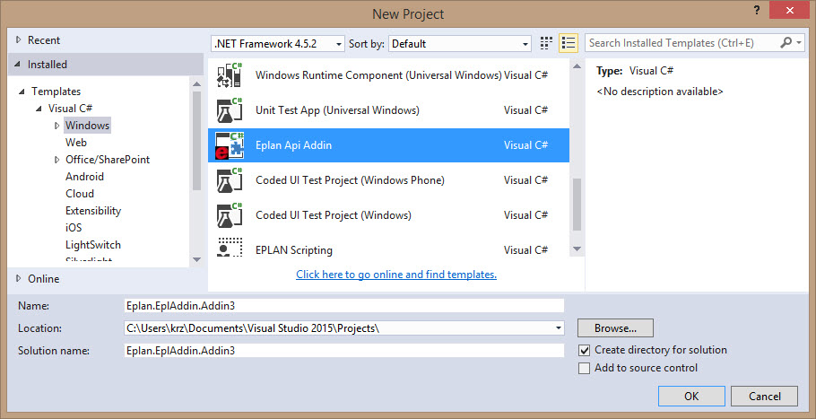
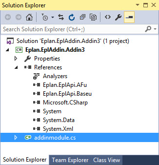
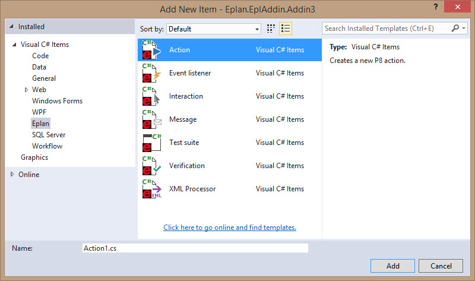

# Creating an add-in in VisualStudio

Compared to using a text editor and the compiler provided by the .Net framework, it is much easier to create an add-in with help of a development environment, like Visual Studio 2017.

To create an add-in, just create a project in Visual Studio using the template "Eplan ApiAddin" from C# Projects:

Please mind to select correct .NET Framework version (currently it is 4.5.2) otherwise the wizard won't appear!

**The new project already references the essentially needed EPLAN API assemblies and a file with the module class:**

You can add a new action class by the "Add New Item" menu point and selecting the template "Eplan Action":

For Visual Basic, the work flow is identical.
