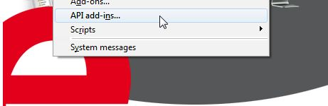
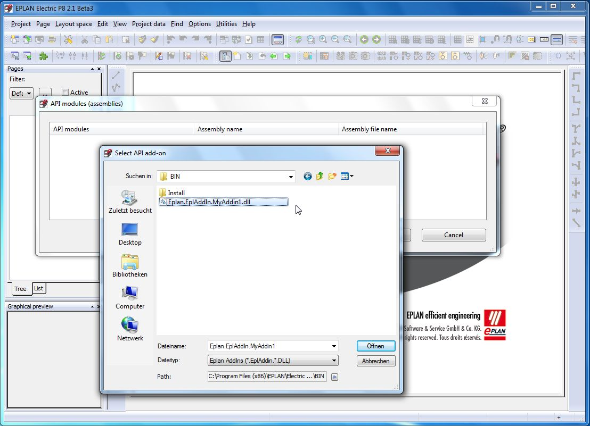

# Creating add-ins in CSharp

This paragraph shows, how to create an EPLAN add-in in C#. To show, that installing the .Net framework already provides all necessary tools (C-Sharp compiler etc.), the add-in is not created as a VisualStudio project, but simply using a text editor and the command line tools of the .Net framework. 

### a) Getting started: 

First, it is useful to create a directory to store the source code for your add-in. For this example we create a folder named SimpleCSharpAddIn. 

Now start your text-editor-of-choice, for instance notepad, and start writing the source. 

### b) Creating the module class: 

Every EPLAN add-in, this means also the C# add-in we are going to create, needs a certain class for managing the add-in. This class has to implement the functions, declared by the IEplAddIn interface: 

```csharp
public class AddInModule: Eplan.EplApi.ApplicationFramework.IEplAddIn
       {
            public bool OnRegister(ref System.Boolean bLoadOnStart)
            {
                  bLoadOnStart=true;
                  return true;
             }
            public bool OnUnregister()
            {
                  return true;
            }
            public bool OnInit()
            {
                  return true;
            }
            public bool OnInitGui()
            {
                  return true;
            }
            public bool OnExit()
            {
                  return true;
            }
      }
```

Now save this source code in folder SimpleCSharpAddIn as a file named `AddInModule.cs`. 

### c) Compiling the assembly (dll) 

Now's the time for using the C-Sharp compiler. The compiler is located in the directory of the .Net framework, for example. C:\WINDOWS\Microsoft.NET\Framework\v2.0.50727. This folder should be in the search path. Open your favored shell and change to the directory SimpleCSharpAddInwhere you just stored `AddInModul.cs` . 

Invoke the C-Sharp compiler (`csc.exe`) with the following parameters: 

csc /target:library /reference:..\\..\\..\\..\bin\`Eplan.EplApi.AFu.dll` /out: `EPLAN.EplAddin.SimpleCSharp.dll` `AddinModule.cs` 

What's the meaning of these parameters? 

  1. /taget:library: We want to create a dll and no exe file.
  2. /reference:..\\..\\..\\..\bin\`Eplan.EplApi.AFu.dll` : search in `Eplan.EplApi.AFu.dll` for all missing data (e.g.. IEplAddIn)
  3. /out: `EPLAN.EplAddin.SimpleCSharp.dll` : name of the dll to build is `EPLAN.EplAddin.SimpleCSharp.dll`
  4. `AddinModul.cs`: name of the source file to compile


If nothing went wrong with the compilation, you'll now find the dll `EPLAN.EplAddin.SimpleCSharp.dll` in the folder SimpleCSharpAddIn. Copy this file to the EPLAN bin folder. 

### d) Loading an AddIn in EPLAN 

Start EPLAN now. If the following system extensions are loaded in EPLAN (which normally should be the case): `EplanEplApiModuleu.erx`, `EplanEplApiModuleGUIu.erx`, you will find the menu point "API add-ins " in your Utilities menu. 



After clicking the menu point, a dialog -- as shown below -- will appear. After pressing the button "Load" you can select `Eplan.EplAddin.SimpleCSharp.dll` from the bin directory. 



Our add-in now appears in the list of the API modules dialog and will be loaded, when EPLAN is `started.That`'s about all it can do. What we need now is Action! 

### e) Adding an Action to the C-Sharp add-in 

Therefore create a second source file and save it as `SimpleCSharpAction.cs` in your source directory. To create an action, we need a class, which implements the IEplAction interface. For a more detailed explanation, see the [Actions](Actions.html) topic. 

```csharp
using Eplan.EplApi.ApplicationFramework;
public class CSharpAction: IEplAction
{
      public bool Execute(ActionCallingContext ctx )
      {
            new Decider().Decide(EnumDecisionType.eOkDecision, "CSharpAction was called!", "", EnumDecisionReturn.eOK, EnumDecisionReturn.eOK);
            return true;
      }
      public bool OnRegister(ref string Name, ref int Ordinal)
      {
            Name  = "CSharpAction";
            Ordinal     = 20;
            return true;
      }
      public  void GetActionProperties(ref ActionProperties actionProperties)
      {
           actionProperties.Description= "Action test with parameters.";
      }
}
```

Now the compiler call needs to be slightly extended: 

csc /target:library /reference:..\\..\\..\\..\bin\`Eplan.EplApi.AFu.dll` /reference:..\\..\\..\\..\bin\`Eplan.EplApi.Baseu.dll` /out:`SimpleCSharpAddIn.dll` `AddinModule.cs` `SimpleCSharpAction.cs` 

If you added an action to an already loaded add-in, the add-in needs to be unloaded and loaded again for the changes to take effect. 

So you just open the "API modules" dialog again, select the add-in in the list and click the "Unload" button. Then load the add-in again. 

Now you can call your new action in EPLAN via a Command line call: 

`W3u.exe` CSharpAction 

When you start the action, the `Execute()` function of the CSharpAction is called. This function just shows a MessageBox with the text "CSharpAction was called!". (new `Decider()`.Decide(`EnumDecisionType.eOkDecision`, "CSharpAction was called!", "", `EnumDecisionReturn.eOK`, `EnumDecisionReturn.eOK`);).

Remarks 

Please mind, that users may start EPLAN in QUIET mode using `W3u.exe` /Quiet or the API could be initialized by an [offline program](UsingEplanAssemblies.html). Because of this, it is not recommended to show any message boxes in the methods of the IEplAddIn interface. If you encounter some problem during registering or initializing an add-in, just create and throw a BaseException or use `BaseException.FixMessage`(...) to add the message to the system messages list.

See Also

[Creating add-ins in Visual Basic.Net](VisualBasicAddins.html)
