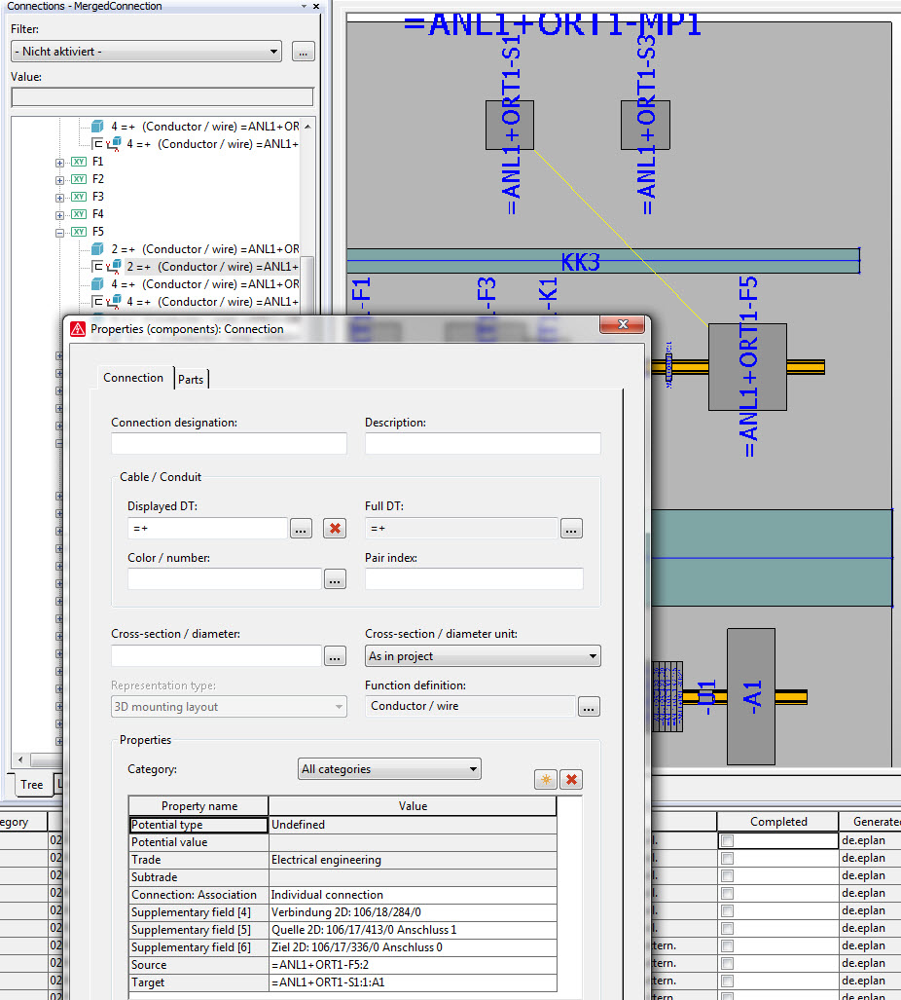

# Connection3D

Connection3D represents 3D connection between two Placement3D objects.

It inherits from the "normal" Connection.

```csharp
//creating 3d connection which exists between two 3d functions
Connection3D oConnection3DNoConnectionPoints = new Connection3D();
oConnection3DNoConnectionPoints.Create(oFunction3D_1, oFunction3D_2);

//creating 3d connection using connection point indexes
Connection3D oConnection3D = new Connection3D();
oConnection3D.Create(oComponent3D_1, 1, oComponent3D_2, 2);

//route connections
List<StorableObject> olist = new List<StorableObject>();
olist.Add(oPlacement3D_1);
olist.Add(oPlacement3D_2);
ConnectionService3D oConnectionService3D = new ConnectionService3D();
oConnectionService3D.RouteConnections(olist);
```


