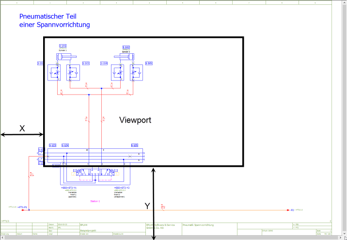

# Displaying a preview

The Eplan.EplApi.HEServices namespace provides the class DrawingService, which contains functionality for outputting objects (WindowMacros, SymbolVariants, Placements, or Pages) on a window or control. 

Displaying the preview takes two steps: 

First step is creating a so-called display list using the CreateDisplayList function. This actually processes the data into a list of graphical primitives, which can be drawn. Depending on what kind of data you want to show, this function will take some time. For example, when you want to create a preview of a macro, CreateDisplayList loads the macro file, analyzes it and creates the items to display. You need to call this function just once for a given preview. 

The second step actually shows the preview (the created display list) on a window. It takes an System.Windows.Forms.PaintEventArgs object as parameter, which is provided by any control in the Paint callback. 

The DrawingService class also provides the possibility to influence the look of the preview in many ways, like zooming and changing the background color. 

In the following example a preview of a macro is created. The first code snippet shows creating the display list: 

=== "C#"

    ```csharp
    Eplan.EplApi.HEServices.DrawingService oDs = new DrawingService();
    //...
    if(oDs == null)
    {
        oDs = new Eplan.EplApi.HEServices.DrawingService();
    }
    if (!(gProject == null))
    {
        try
        {
       oDs.DrawConnections = true;
       oDs.MacroPreview = true;
       oDs.CreateDisplayList(strObj, "", 0, gProject);
        }
        catch (System.Exception ex)
        {
            new Decider().Decide(EnumDecisionType.eOkDecision, "Can't create display list: \r\n" + ex.Message, "", EnumDecisionReturn.eOK, EnumDecisionReturn.eOK);
        }
        //raise the Paint event
        oForm.Picture1.Invalidate();
    }
    ```

=== "VB"

    ```vb
    If oDs Is Nothing Then
       oDs = New Eplan.EplApi.HEServices.DrawingService
    End If
    If Not gProject Is Nothing Then
       Try
          oDs.DrawConnections = True
          oDs.MacroPreview = True
          oDs.CreateDisplayList(strObj, "", 0, gProject)
       Catch ex As System.Exception
          Dim dec As Decider = New Decider
          dec.Decide(EnumDecisionType.eOkDecision, "Can't create display list:" & vbCrLf & ex.Message, "", EnumDecisionReturn.eOK, EnumDecisionReturn.eOK)
       End Try
       'raise the Paint event
       oForm.Picture1.Invalidate()
    End If
    ```

The next piece of source code shows drawing the display list in the Paint method of a picture box: 

=== "C#"

    ```csharp
    private void Picture1_Paint(object sender, System.Windows.Forms.PaintEventArgs e)
    {
     if (!(m_DS == null)) {
       try {
         m_DS.DrawDisplayList(e);
       } catch (System.Exception ex) {
         new Decider().Decide(EnumDecisionType.eOkDecision, "Can't draw display list:" + "\r\n" + ex.Message, "", EnumDecisionReturn.eOK, EnumDecisionReturn.eOK);
       }
     }
    }
    ```

=== "VB"

    ```vb
    Private Sub Picture1_Paint(ByVal sender As Object, ByVal e As System.Windows.Forms.PaintEventArgs) Handles Picture1.Paint
        If Not m_DS Is Nothing Then
            Try
                m_DS.DrawDisplayList(e)
            Catch ex As System.Exception
                Dim dec As Decider = New Decider
                dec.Decide(EnumDecisionType.eOkDecision, "Can't draw display list:" & vbCrLf & ex.Message, "", EnumDecisionReturn.eOK, EnumDecisionReturn.eOK)
            End Try
        End If
    End Sub
    ```

### 

### Setting image size and the viewport 

For drawing more complex images it can be necessary to set resolution and a viewport of the drawn image.

Viewport is a polygon which represents part of a page that will be rendered :



This can be done by means of SetViewport method. Coordinates should be passed in graphical coordinate system.

If the passed dimensions are not proportional to the dawning area, they are adjusted automatically in a way that aspect ratio is kept:

=== "C#"

    ```csharp
     m_Ds.SetViewport(10.0, 200.0, 300.0, 20.0);
    ```

In case of 3D drawings, it is also necessary to set image size, otherwise its quality can be worse than in Eplan GED:

=== "C#"

    ```csharp
     m_Ds.SetWindow(0, 600, 1200, 0);
    ```

