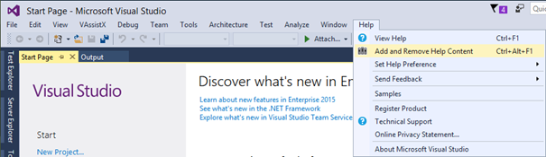
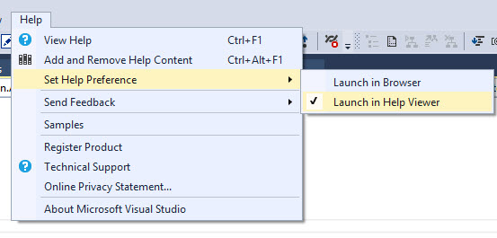

# Help structure

The documentation you are reading, is divided into two sections : 

\- User Guide introduces you into how to set up a development environment and start developing or use more advanced functionality 

\- API Reference. It lists and describes in detail all the namespaces, classes methods, etc. of the EPLAN API. 

API Support setup installs API Help in HTML and Microsoft Help Viewer format. This way it can be accessed online or locally from a disk (i.e. in offline mode). 

### API Help formats

In offline mode, API Help can be accessed by the shortcut on a desktop (HTML format) or from Visual Studio (Microsoft Help Viewer). 

The later one is the standard help system format used by Visual Studio. This way it can be accessed as another VS help installed locally, i.e. by pressing F1 key. 

Sometimes setup cannot correctly register the help under Visual Studio. In this case it can be done manually using following steps:

a) Start Microsoft Help Viewer using Help->Add and Remove Help Content from Visual Studio

b) In 'Manage Content' tab, please select Disk installation source, then browse helpcontentsetup.msha file from the directory where was API Help installed. By default is should be in %ProgramData%\EPLAN\O_Data\API-Support\<Eplan version>\doc 

c) Select 'Add' link and press 'Update' button 

d) Make sure that the help is registered by browsing EPLAN API content in Microsoft Help Viewer. 

e) In order to use the help integrated with Visual Studio, please set preferred help to the Help Viewer :

Please consider that since Visual Studio 2017, Microsoft Help Viewer is an optional installation component, so needs to be additionally added by the Visual Studio Installer.
