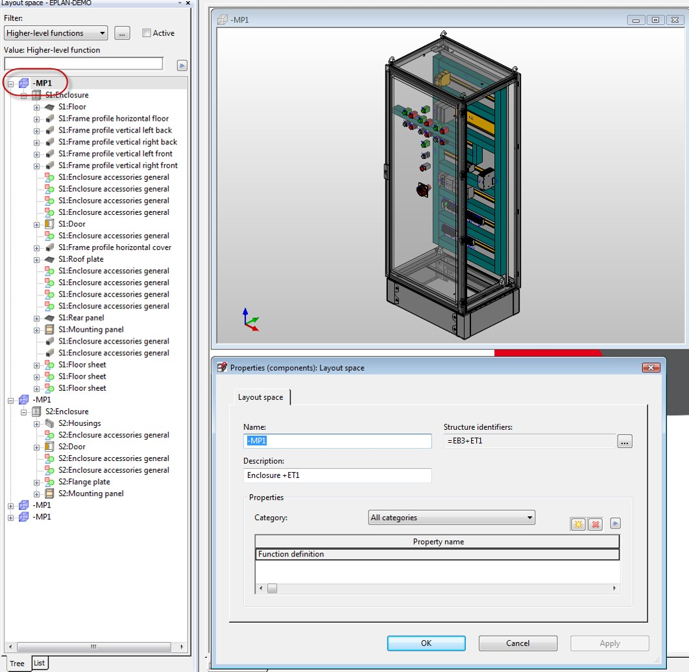

# InstallationSpace (layout space in GUI)

InstallationSpace represents a 3-dimensional space where objects can be located. 

It is also a root node for other 3d-objects in the 'Layout spaces' navigator. 

Example below shows how to create an InstallationSpace: 

```csharp
InstallationSpace oInstallationSpace = new InstallationSpace();
oInstallationSpace.Create(oProject, "InstallationSpace test");
```

We can retrieve existing InstallationSpaces from a project this way: 

```csharp
InstallationSpace[] arrInstallationSpace = oProject.InstallationSpaces;
```

In GUI it is called 'Layout space'. It is independent on pages in a project. 


