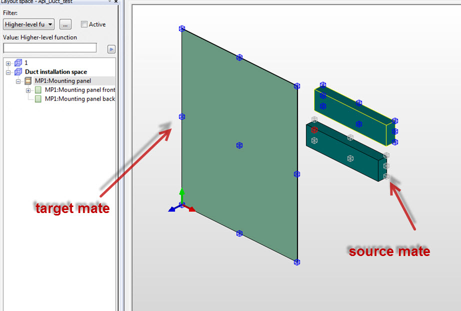
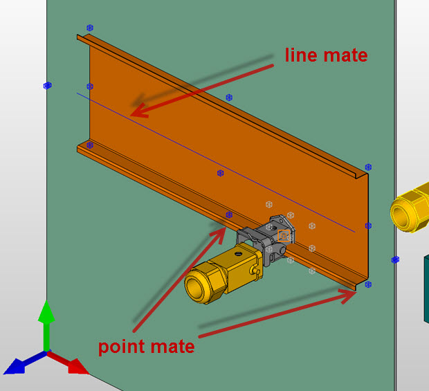

# Mates

There is also possibility to transform 3D objects by snapping i.e. by means of auxiliary points called "mates".

**There are 2 kinds of mates:**

* source mates - points of a source object that we want to transform. In GUI they are grey.
* target mates - the ones that we snap to. In GUI they are blue.



**Another division is besed on a purpose and a shape of mates:**

* point mates (classes [PointMate](Eplan.EplApi.DataModelu~Eplan.EplApi.DataModel.E3D.PointMate.md), [HandleMate](Eplan.EplApi.DataModelu~Eplan.EplApi.DataModel.E3D.HandleMate.md), [BasePointMate](Eplan.EplApi.DataModelu~Eplan.EplApi.DataModel.E3D.BasePointMate.md), [MountingPointMate](Eplan.EplApi.DataModelu~Eplan.EplApi.DataModel.E3D.MountingPointMate.md), [PlacementAreaPointMate](Eplan.EplApi.DataModelu~Eplan.EplApi.DataModel.E3D.PlacementAreaPointMate.md))
* line mates (classes [LineMate](Eplan.EplApi.DataModelu~Eplan.EplApi.DataModel.E3D.LineMate.md), [MountingLineMate](Eplan.EplApi.DataModelu~Eplan.EplApi.DataModel.E3D.MountingLineMate.md))

* plane mates (class [PlaneMate](Eplan.EplApi.DataModelu~Eplan.EplApi.DataModel.E3D.PlaneMate.md))



### Getting mates

**Mates can be retrieved from a Placement3D using methods:**

```csharp
PointMate[] GetSourceMates(Mate.Enums.PlacementOptions ePlacementOptions)
PointMate FindSourceMate(string name, Mate.Enums.PlacementOptions ePlacementOptions)
Mate[] GetTargetMates(bool bConsiderMountingClearance)
Mate FindTargetMate(string name, bool bConsiderMountingClearance)
```

### Snapping

Snapping mates causes that one object is positioned close the second, i.e. a source mate from one object is in position of a target mate of another object. In this case we need to find relevant mates from both objects and then do snapping by SnapTo method. Here is an example how to snap a cabinet to another one by a point target mate:

```csharp
Cabinet oCabinet2 = new Cabinet();
oCabinet2.Create(oProject, "TS 8886.500", "1");
//placing a cabinet next to another cabinet with 0.0 offset
oCabinet2.FindSourceMate("C3", Mate.Enums.PlacementOptions.None)
.SnapTo(oCabinet.FindTargetMate("CUB4", false), 0.0);
```

Here are also examples of snapping to a line and plane mate. They both are base mates - this mean that snapping to them will automatically set a source object as a child of a target. Also the orientation of a source item is adjusted to a target:

```csharp
//get front plane of mounting panel
MountingPanel oMountingPanel = oCabinet.Children[1] as MountingPanel;
Plane oFrontPlace = oCabinet.Planes[0];
//create a mounting rail with a length of 150
MountingRail oRail = new MountingRail();
oRail.Create(oProject, "TS 110_15", "1", 500.0);
//placing a rail by using a plane mate as a target (located 100,200 from start of mounting panel,

//without any rotation)
oRail.GetSourceMates(Mate.Enums.PlacementOptions.None)[2]
.SnapTo(oFrontPlace.BaseMate, 0.0, 100.0, 200.0);
//creating a terminal
Component oTerminal = new Component();
oTerminal.Create(oProject, "SIE.4AV2400-2EB00-0A", "1");
//placing it on a mounting rail with offset 100 from the beginning of it.

//Target (oRail.BaseMate) is a line mate.
oTerminal.FindSourceMate("M4", false).SnapTo(oRail.BaseMate, 100.0);
```

Please be aware that not every mates can be snapped each other. This is determined by property [Mate.MatchingMateNames](Eplan.EplApi.DataModelu~Eplan.EplApi.DataModel.E3D.Mate~MatchingMateNames.md) . To make sure that a mate can be snapped to another, please use method [PointMate::CanSnapTo](Eplan.EplApi.DataModelu~Eplan.EplApi.DataModel.E3D.PointMate~CanSnapTo.md).

### Creating custom mates

It is also possible to create a custom mates, for example a mounting point or a handle. In this case a mate is created at first as a transient object, and then needs to be stored on a Placement3D:

```csharp
//create a handle relative to placement area
var transformationToPlacementArea = new Matrix3D();
transformationToPlacementArea.Translate(new Vector3D(50.0, 500.0, 0.0));
var transformation = transformationToPlacementArea * placement3D.PlacementArea.RelativeTransformation;
var handle = new HandleMate();
handle.Create(new MultiLangString(), transformation);
placement3D.AddMatePersistent(handle);

//create a handle with extended logic

var handleWithExtendedLogic = new HandleMate();
handleWithExtendedLogic.Create(new[] {"V1", "V2"}, new MultiLangString(), new Matrix3D());
placement3D.AddMatePersistent(handleWithExtendedLogic);

//create a base point
var basePoint = new BasePointMate();
basePoint.Create(BasePointMate.Enums.Name.FrameProfileDownLeftRear,

    new MultiLangString(),
    new Matrix3D {OffsetX = 200.0, OffsetY = 300.0});
placement3D.AddMatePersistent(basePoint);

//create a mounting point
var mountingPoint = new MountingPointMate();
mountingPoint.Create("Test mounting point",

    new MultiLangString(),
    new Matrix3D{OffsetY = 100.0, OffsetZ = 400.0});
placement3D.AddMatePersistent(mountingPoint);

 //create a mounting line
var mountingLineMate = new MountingLineMate();
mountingLineMate.Create("Test mounting line",
    new MultiLangString(),
    new PointD3D(10.0, 10.0, 10.0), new PointD3D(110.0, 210.0, 310.0));
placement3D.AddMatePersistent(mountingLineMate);
```

Please be aware that the coordinates of a mate are relative until it is not persistent, i.e. without [.Placement](Eplan.EplApi.DataModelu~Eplan.EplApi.DataModel.E3D.Mate~Placement.md) set. After calling [Placement3D::AddMatePersistent](Eplan.EplApi.DataModelu~Eplan.EplApi.DataModel.E3D.Placement3D~AddMatePersistent.md), they are recalculated and become absolute.

See Also

[Transformations in 3D space](Transformations_in_3D_space.md)
