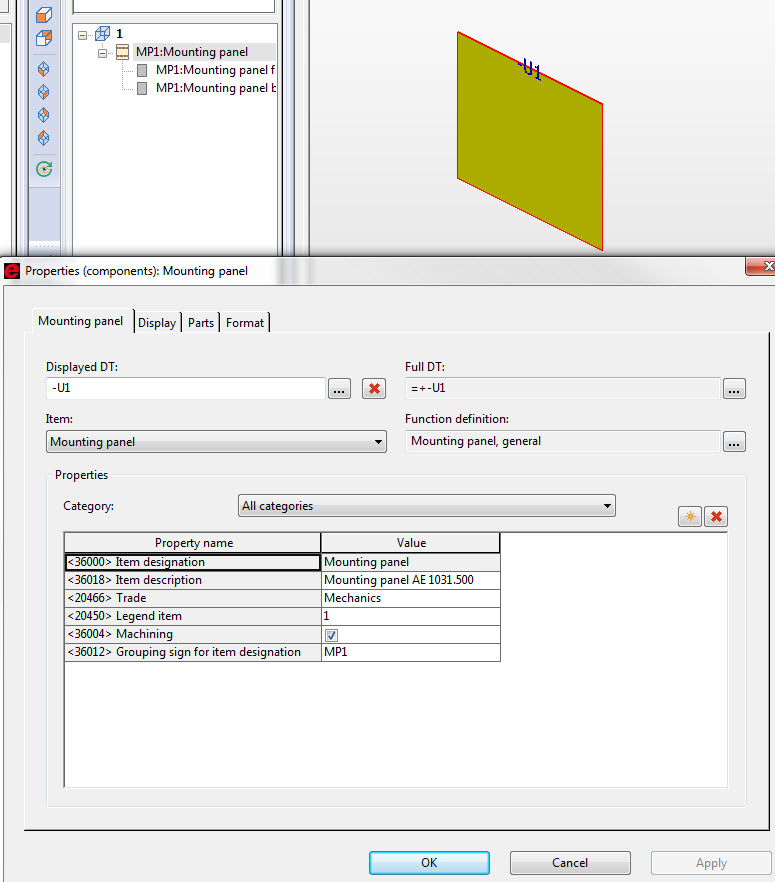
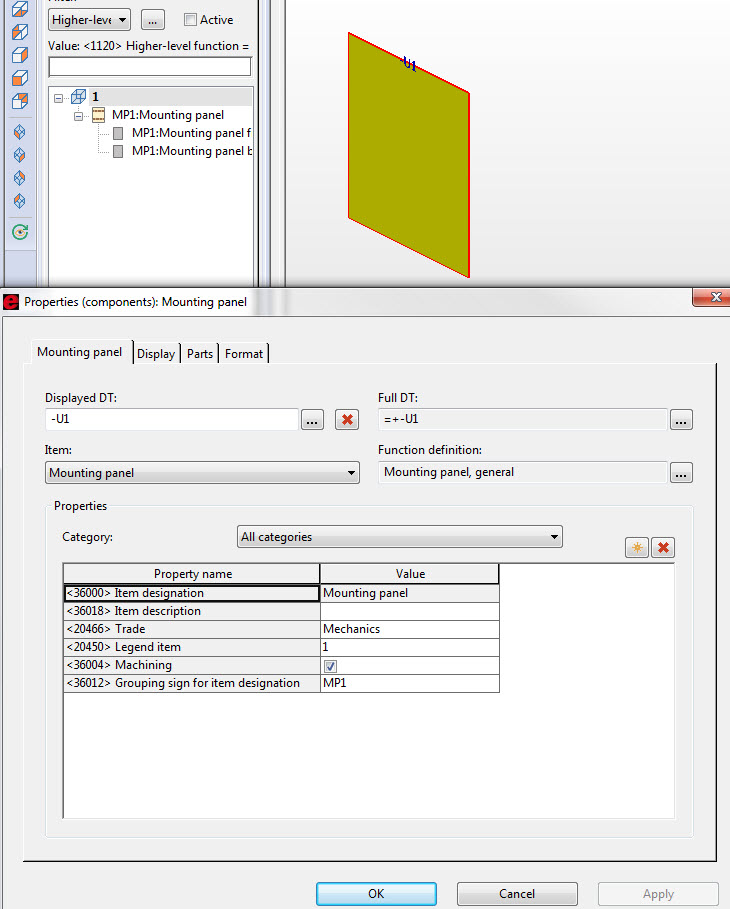

# MountingPanel (mounting panel in GUI)

### Mounting panel (with article):

```csharp
MountingPanel oMountingPanel = new MountingPanel();
oMountingPanel.Create(m_oTestProject, "MP AE 1031.500", "1");
oMountingPanel.Parent = oCabinet; //can be also for example InstallationSpace
```



### Free mounting panel:

```csharp
MountingPanel oMountingPanel = new MountingPanel();
oMountingPanel.Create(m_oTestProject, 300.0, 400.0, 2.0);
oMountingPanel.Parent = oCabinet;
```


