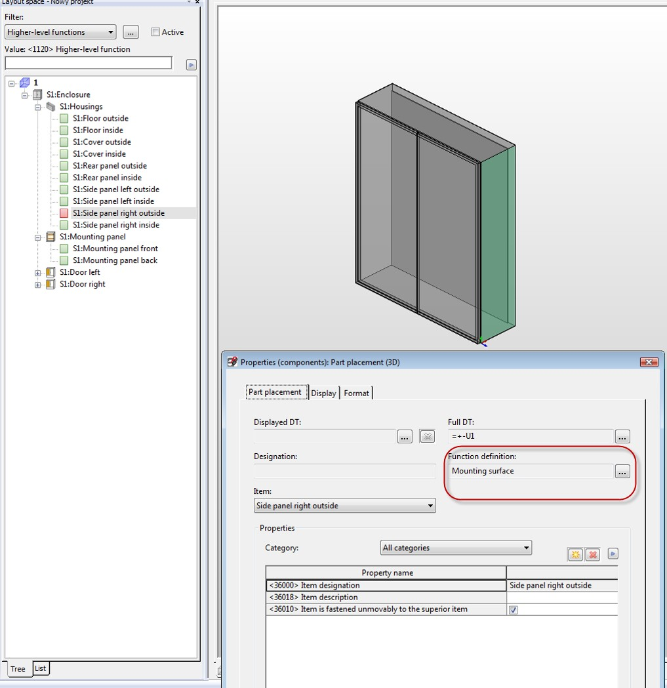

# Plane (mounting surface in GUI)

Plane class represents a surface object on which Components can be placed 

```csharp
MountingPanel oMountingPanel = new MountingPanel();
oMountingPanel.Create(oTestProject, "MP AE 1030.500", "1"); 
oMountingPanel.Parent = m_oInstallationSpace; Plane oPlane1 = oMountingPanel.Children[0] as Plane; 
Plane oPlane2 = oMountingPanel.Children[1] as Plane; 
```


