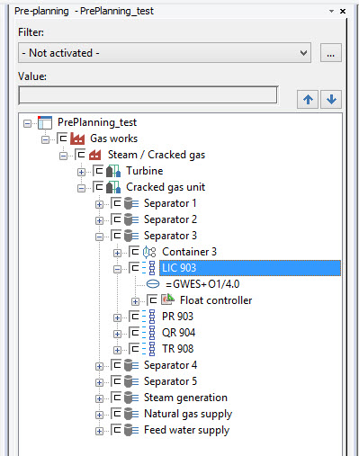

# PCTLoop

PCTLoop class represents PCT loops in a project. They are logical units to measure or control.

C# |  Copy Code  
---|---  
      
    
    SegmentDefinition oSegmentDefinition = m_oTestProject.GetSegmentDefinition("Eplan.PCT.Loop");
    PCTLoop oPCTLoop  = PCTLoop.Create(oSegmentDefinition) as PCTLoop;
      
  
In GUI they are visible in Pre-planning navigator :

