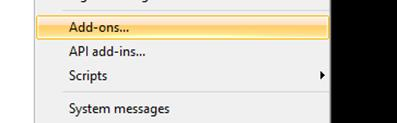
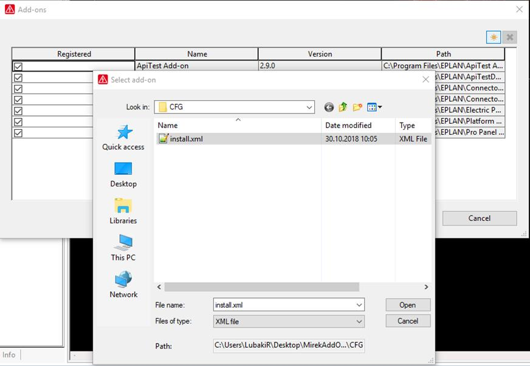
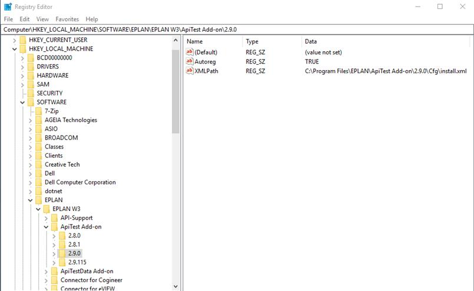
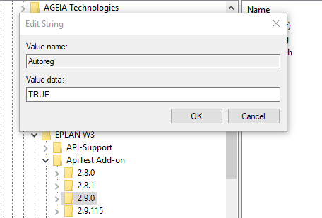
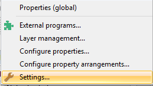
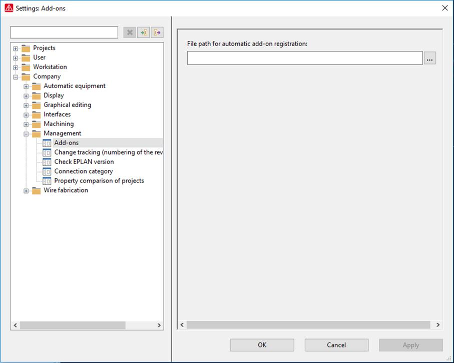

# Registration

### Manual registration of an add-on

Start EPLAN now. In menu, Utilities you will find the menu point “Add-ons”.

Figure 1: Menupoint "Add-ons"

After clicking the menu point, a dialogue – as shown below – will appear. By pressing the button you can select the install.xml file from the CFGdirectory.

Figure 2: Manualregistration of an add-on

The add-on now appears in the add-on list. To register it, you have to activate the belonging check-box in the “Registered” column. Only then, that in the BINfolder saved dllfile will appear in the list of the API modules dialogue and will be loaded.

Registration of an add-on via an action

It is also possible to register an add-on via an action call. This is based on automatic actions for the EPLAN command line functionalities – also called ‘Command Line Actions’.

Tip:

For further information about “Automatic actions” see our API Help.

For the proper use of that command line action, it is necessary to pass further general command line parameters.

**Parameter** |  **Description**  
---|---  
Path |  The path where the add-on is located  
InstallFile |  The complete path to the install.xml  
  
Example:

Registering Add-ons:

XSettingsRegisterAction /Path:c:\MyAddOn

XSettingsRegisterAction /InstallFile: c:\MyAddOn\CFG\Install.xml

After registering the add-on via an action call, you have to verify if the add-on is registered in the Add-ons dialogue and the belonging add-in files are loaded.

### Automatic registration of an add-on

There are two ways to initiate the automatic registration of an add-on when EPLAN is started.

Automatic registration with registry settings

In the “Registry Editor” – see figure y – all EPLAN installation can be found at:

HKEY_LOCAL_MACHINE / SOFTWARE / EPLAN / EPLAN W3

Figure 3: Automatic registration with registry settings

An add-on can be found like this:

<Add-on>

<Version>

Autoreg true

XMLPath C:\Program Files\EPLAN\ApiTest Add-on\2.9.0\Cfg\install.xml

Autoreg: When this flag is true, the add-on can register automatically.

XMLPath: The path to install.xmlof the add-on.

After double clicking on <Autoreg>, a dialogue – as shown below – will appear.

Figure 4: Value editor

Now you can set the value for the automatic registration to “TRUE” or “FALSE”.

Automatic registration with company settings

Start EPLAN now. Go to the menu item “Options” and select the menu point “Settings…”.

Figure 5: Menu point "Settings..."

After clicking the menu point, the settings service dialogue – as shown below – will appear. By navigating to Company -> Management -> Add-onsyou can then register a server path to EPLAN.

Figure 6: Add-ons settings

At startup of EPLAN, this folder is searched for install.xmlfiles. When an add-on install.xml is found (means the install.xmlis in a “cfg” folder, the version matches, etc.) the add-on will be registered.
