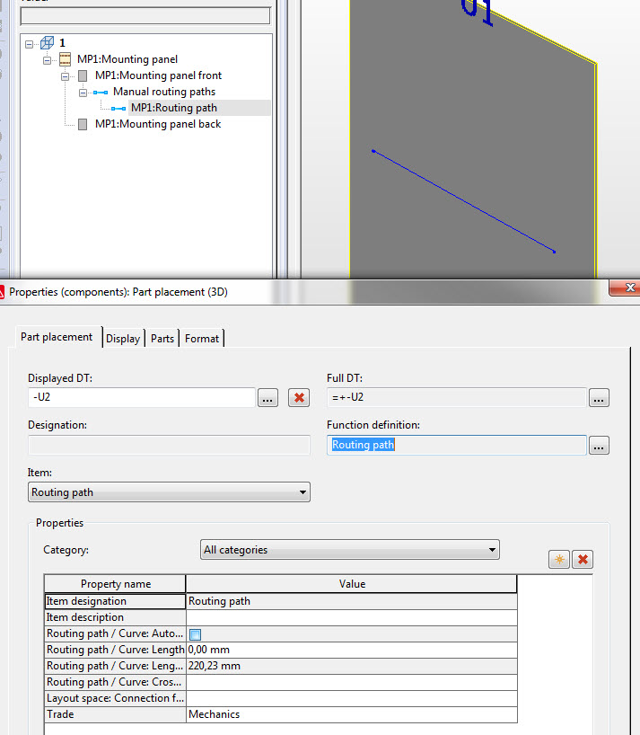

# RoutingSegment (routing path in GUI)

Represents an object in EPLAN which can route connections.

**It can be generated by 2 ways :**

- by RoutingSegment::Create

- by ConnectionService3D::CreateRoutingSegments

