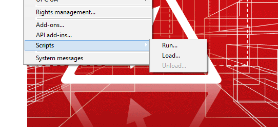

# Scripts

You can run scripts in EPLAN without having licensed the EPLAN API. Scripts are executable program code, written in C# (*.cs files) or Visual `Basic.Net` (*.vb files). Scripts always exist as source code. When you start a script, it will be loaded into the system, compiled and then executed.

For scripting, the following menu points in the "Utilities" menu are available.



After calling the menu point "Run...", a file dialog appears and a script file to execute can be selected.

In a script following Microsoft .Net framework assemblies can be used :

* `System`
* `System.XML`
* `System.Drawing`
* `System.Windows.Forms`

**also these EPLAN assemblies are referenced by default:**

=== "`Eplan.EplApi.Base`"

    ```
    * Namespace Eplan.EplApi.Base
    ```

=== "`Eplan.EplApi.ApplicationFramework`"

    ```
    * Namespace Eplan.EplApi.ApplicationFramework
    * Namespace Eplan.EplApi.Scripting
    ```

=== "`Eplan.EplApi.Gui`"

    ```
    * Namespace Eplan.EplApi.Gui
    * NameSpace Eplan.EplApi.Scripting
    ```

**There is no way to reference additional assemblies (.Net framework, EPLAN or other providers)!**

This feature is only available for Eplan API developers having 'EPLAN API Extension' license.
