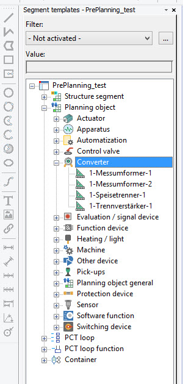

# SegmentDefinition

SegmentDefinition class represents segment definition objects.

They define the behavior and properties of a segment.

C# |  Copy Code  
---|---  
      
    
    SegmentDefinition oSegmentDefinition = new SegmentDefinition();
    oSegmentDefinition.Create("test_001", m_oTestProject.SegmentDefinitions[0]);
      
  
In GUI from they are visible in 'Segment templates' navigator:

