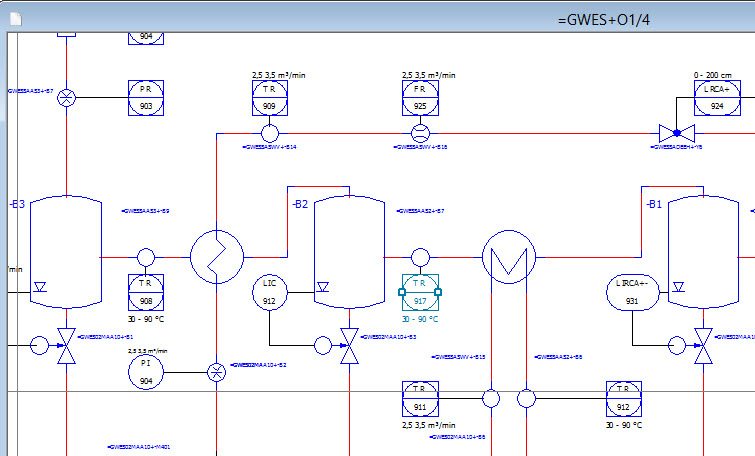

# SegmentPlacement

SegmentPlacement class represents segment object on 2d page. Because of this, the class inherits from SymbolReference.

```csharp
//prepare a segment
StructureSegment oStructureSegment = StructureSegment.Create(m_oTestProject.SegmentDefinitions[0]) as StructureSegment;
oStructureSegment.Name = "test1c";

//prepare a page
Page oNewPage = new Page(m_oTestProject, DocumentTypeManager.DocumentType.Planning, new PagePropertyList());
oNewPage.Name = "SegmentPlacement_Test001c";
         

//create SegmentPlacement
SegmentPlacement oSegmentPlacement = new SegmentPlacement();
oSegmentPlacement.Create(oStructureSegment, oNewPage);
```

SegmentPlacements are visible in GED, for example:


