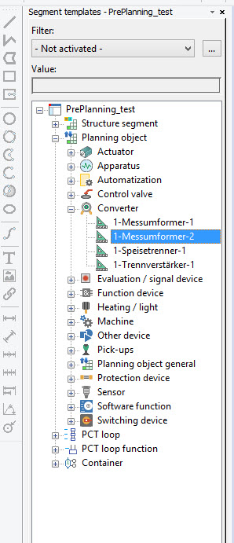

# SegmentTemplate

SegmentTemplate class represents segment template objects. They contain common values of some properties. 

Segment inherits these values from a template.

C# |  Copy Code  
---|---  
      
    
    SegmentTemplate oSegmentTemplate = new SegmentTemplate();
    oSegmentTemplate.Create(oSegmentDefinition);
    oSegmentTemplate.Name = "SegmentTemplate_006";
      
  
In GUI from they are visible in 'Segment templates' navigator:

