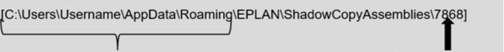

# Shadow Copying

Since version 2.6, EPLAN API assemblies are shadow copied, i.e. during registration, they are stored into a temporary folder, and loaded from there (See API Help: Shadow Copying API Assemblies).

This concerns both add-ons and add-ins.

In case of addons, the whole addon's bin directory with subdirectories will be copied to the user application roaming directory (%appdata%\EPLAN\ShadowCopyAssemblies\Process-ID\Addon-Name). 

Example :

Application roaming directory Process-ID

So all files (*.dlls, *.xml etc.) and all bin subdirectories (language subdirectories etc.) are also copied. This is done when EPLAN starts and an addon is registered or when an addon is manually registered from Add-ons dialogue. 

Eplan will load addon's assemblies from the shadow directory and not from the original addon directory. So an addon could be updated without the need to stop all Eplan instances using the addon.

### What EPLAN does ?

At any start of EPLAN, the registry or the path for server add-ons is scanned for new add-ons. The `install.xmlis` read and the following things are done:

· Does this addon fit to the main version?

· Is the correct license option booked?

· Is the version correct?

When everything is done so far EPLAN then:

· registers the new addon:

· Read all *.xmlfiles from the CFGfolder. The settings are copied to the settings of the main version.

· Read the eplset<applicationmodifer>.xml: All binaries defined there are loaded now.

· Load the API modules.

· Register the API references.

· Register the scripts.

· Copy the base data of the add-on to the base data of EPLAN.
