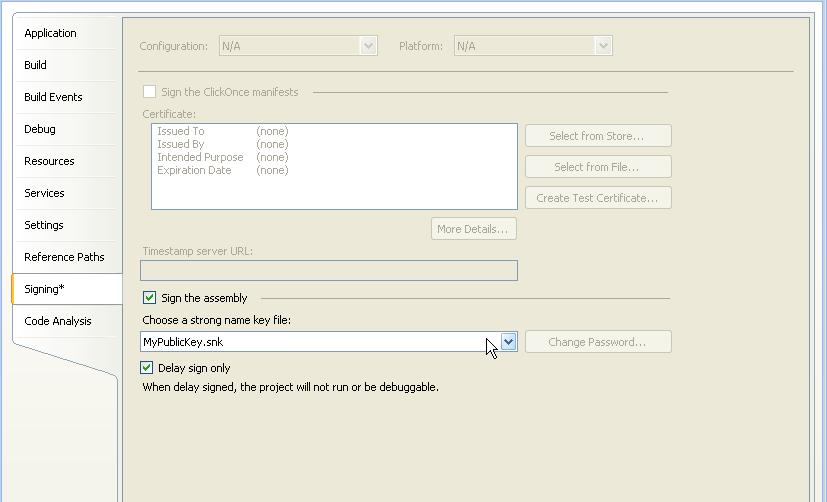
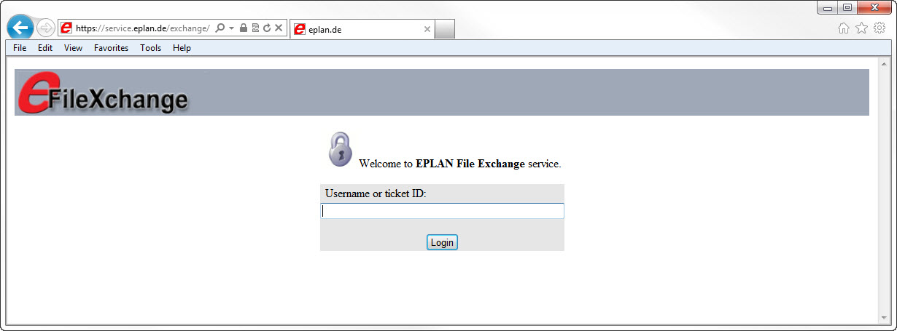

# Signing EPLAN assemblies

As a part of your EADN (EPLAN API Developer Network) partnership with EPLAN Software & Service, you get the opportunity to sign your software interface with our products. This allows you (or your customer) to use API assembly without having an EPLAN API developer license on his workstations. Instead, he receives - through you - a runtime license for an API interface.

This chapter describes how you (or your developers) should proceed, to get properly signed EADN modules.

### What is possible with API licenses ?

At first there should be clarified why signing is necessary. There are 2 kinds of API licenses :

a) API developer license. It should be used only for development and testing of an API interface. Normally it has a limitation of a maximum size of EPLAN projects to 5 pages.

Only unsigned API programs can be loaded using it

b) API runtime license. In this case there can be used only signed API programs, so we need to sign it. The routine how to do it is described bellow.

A user can check available licenses and select one by starting EPLAN with shift key (then a 'Select license' dialog will appear).

When EPLAN is already running, current license can be retrieved from :

a) 'About EPLAN' dialog

b) in API by `EplApplication.License property` and License class.

### Concept of EADN signing

EADN uses a concept of combining standard .Net strong naming with additionally including an EPLAN license option to the software. To achieve this combination, please follow the instructions in this chapter.

### Requirements

After you have concluded your EADN contract and announced creating a new software interface with EPLAN, you will receive from us :

a) the login data of your account for the EPLAN file exchange web site ( https://`service.eplan.de`/exchange )

b) a file containing the public part of a standard signature key, normally used for strong-naming a .Net assembly. We created this key especially for your software.

### How to proceed ?

Take the following steps to get your application EADN-signed:

a) Modify the `AssemblyInfo.cs`

In your software projects, you need to add an additional attribute to your AssemblyInfo files of all the assemblies, which are referencing EPLAN API Assemblies. The EplanSignedAssemblyAttribute is implemented in the `Eplan.EplApi.Starter.dll`, which you always have to reference in your API application. The following example shows how to use the attribute in your AssemblyInfo file:

```csharp
using System.Reflection;
using System.Runtime.CompilerServices;
using System.Runtime.InteropServices;
using Eplan.EplApi.Starter;
//..
[assembly: EplanSignedAssemblyAttribute(true)]
```

b) Delay sign the assemblies

The easiest way for delay signing your assemblies (dll or exe) is entering the public key file in the signing properties of your software projects in Visual Studio. Check "Sign the assembly" and activate the "Delay sign only" flag. See the following image:



The delay signing is done, when building the software project and with it creating the assembly.

Alternatively, you can use Microsoft Assembly Linker `Al.exe` to manually delay sign assemblies. Please refer to respective MSDN documentation.

c) Zip and Upload to EPLAN File Exchange

Create one or several ZIP archives containing all the assemblies to be signed. Please take into account that the zip files may not be password-protected.

Log in to the EPLAN file exchange portal at https://`service.eplan.de`/exchange with the login data mentioned above.



Select the software project for which the assemblies should be signed. The project has to be the same as the one for which you received and used the respective public key.

Now upload the zip file to our server by clicking "Upload one file", selecting the zip file and clicking "Upload". This triggers the signing process.

d) Receive the signed Assemblies

As soon as your files have been signed you will receive an email that you can download the ready-signed files again from our file exchange portal. Log in again and find your files under "My downloads". The ZIP file contains an additional log file with a message, whether the signing was successful or not. In case the signing procedure failed, the log file will contain further information about the problem.

Special cases

a) How to sign automatically generated serialization dlls

If you use an automatically created serialization dll for your classes, you need to delay-sign them via the `sgen.exe` tool. This tool can be found the SDK directory of your development environment.

Example:

"C:\Program Files\Microsoft Visual Studio 8\SDK\v2.0\bin\`sgen.exe`" /compiler:/delaysign+ /assembly:"`MyDllToBeSerialized.dll`" /proxytypes

/reference:"`Eplan.EplApi.AFu.dll`" /reference:<...all further references you need> /compiler:/keyfile:"D:\`MyPublicKey.snk`"

b) Signing of your own COM interop dlls

As you probably know, any strong-named .Net assembly can only reference / load other strong-named assemblies. In case your application registers COM dlls, the development environment normally automatically creates so-called interop dlls, which contain the .Net wrapping of the respective COM methods. Normally, these dlls are not signed. To create these assemblies in an already delay-signed way Microsoft provides the command line tool `tlbimp.exe` also to be found in the SDK directory of your development environment. See the following example, how it is used:

"C:\Program Files\Microsoft Visual Studio 8\SDK\v2.0\Bin\`tlbimp.exe`" `yourComInterface.dll` /delaysign /publickey:C:\`YourKeyFilePublic.snk` /out:`Interop.yourComInterface.dll`

What to do in case of problems ?

In case of any problems with signing, please write to EPLAN API Support: support-eplan@`eplan.de`.
