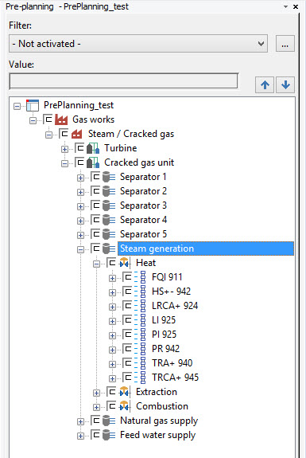

# StructureSegment

StructureSegment class represents structure segment objects. They are used to represent part of the project structure.

C# |  Copy Code  
---|---  
      
    
    SegmentDefinition oSegmentDefinition = m_oTestProject.GetSegmentDefinition("Eplan.Base.StructureNode");
    StructureSegment oStructureSegment = StructureSegment.Create(m_oTestProject.SegmentDefinitions[0]) as StructureSegment;
    oStructureSegment.Name = "test1b";
      
  
In GUI from they are visible in Pre-planning navigator:

