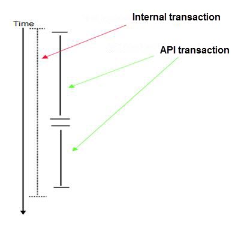
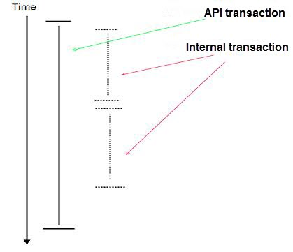

# Transactions

Term "transaction" means set of operations that make up a unit of work on EPLAN project database. They can be executed all together or none. Such grouping assures data integrity and consistency even in case of system failure. For example :

```csharp
using (Transaction oTransaction = new TransactionManager().CreateTransaction())
{
     oFunction1.Name = "=+-NewTestFunctionName_1";
     oFunction2.Name = "=+-NewTestFunctionName_2";
     oTransaction.Commit();
}
```

So in case when execution of the code is broken off before `Commit()` was called, properties "Name" remain unchanged.

### Nesting API transactions

It is also possible to nest transactions in API. For example :

```csharp
oFunction.Name = "oFunction0";
using (Transaction oTransaction1 = new TransactionManager().CreateTransaction())
{
     using(Transaction oTransaction2 = new TransactionManager().CreateTransaction())
     {
          oFunction.Name = "Function2";
          oTransaction2.Commit();
     }
     Console.Writeline(oFunction.Name) //will be "oFunction2" returned,
     oFunction.Name = "Function1";
     Console.Writeline(oFunction.Name) //will be "oFunction1" returned,
}
Console.Writeline(oFunction.Name) //will be "oFunction0" returned, because outer transaction oTransaction1 wasn't committed
```

In this case an inner transaction is treated as one of operations of the outer transaction.

### Internal EPLAN and API transactions

**We distinguish two types of transaction:**

  * API transactions - they are opened explicitly or implicitly from API. Explicit open is done by creating Transaction object from TransactionManager:

```csharp
Transaction oTransaction = new TransactionManager().CreateTransaction();
```

Implicit open is done by creating the same Transaction object by some EPLAN operations, (like creating new objects, changing a property) in a way that is invisible for API user

  * EPLAN internal transactions - they are started inside of EPLAN framework, so are opened and closed implicitly

Using API transactions and internal ones in the same time can bring problems. So please consider following rules to unique them:

  * API transaction within an internal transaction.



API transaction may always be opened within internal transaction. API developer has a possibility to check whether an API transaction is open using following property :

```csharp
TransactionManager::IsTransactionRunning
```

A commit of API transaction leads to no change in the database and is saved in the database only with the termination of internal transaction. Abort in API transaction breaks off no internal transaction, but throws an exception, because an internal transaction is running and cannot be broken off.

  * An internal transaction within API transaction



An internal transaction may be always opened within a API transaction. The API developer has the possibility to check each time whether an internal transaction is open using following property:

```csharp
TransactionManager::IsEplanTransactionRunning
```

If an internal transaction is to be opened, the API transaction becomes committed. If an internal transaction is again closed (Abort or Commit), then the API transaction will be started again. API transaction class has also property which gives information whether an internal transaction was opened and closed within the API one :

```csharp
Transaction::IsImplicitEplanTransactionCommited
```

