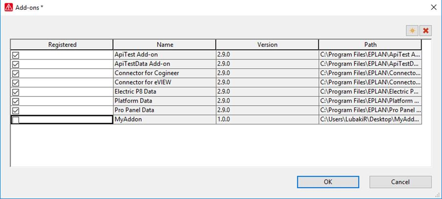

# Unregistration

### Manual unregistration of an add-on

After clicking the Add-ons menu point (as shown in figure 1), the same dialogue – as shown in figure 2 – will appear. After deactivating the add-on, the button  will be enabled.

Figure 7: Unregister add-ons

By clicking on the delete button, the add-on will be deleted from the list and also will the belonging add-in be deleted from the list of the API module dialogue.

Warning:

The delete button  will only be enabled, when the add-on was manually registered before.

### Unregistration of an add-on via an action

It is also possible to unregister an add-on via an action call.

**Parameter** |  **Description** 

---|--- 

Path |  The path where the add-on is located 

InstallFile |  The complete path to the `install.xml` 

AllowAutoInstall |  When the value is set to TRUE Remove the marker for auto install, then the add-on is auto installed next time 

 

Example:

Registering Add-ons:

XSettingsUnregisterAction /Path:c:\MyAddOn

XSettingsUnregisterAction /InstallFile: c:\MyAddOn\CFG\`Install.xml`

XSettingsUnregisterAction /Path:c:\MyAddOn /AllowAutoInstall:TRUE

After unregistered the add-on via the action call, you may want to verify if the add-on is actually unregistered in the Add-ons dialogue and the belonging add-in files are unloaded.

Automatic unregistration of an add-on

Like there are two ways to initiate the automatic registration of an add-on when EPLAN is started, there are two ways to reset this setting as well.

Automatic unregistration with registry settings

To reset the automatic registration with the Registry Editor, you only have to change the value data to FALSE (see figure 4).

Automatic unregistration with company settings

To reset the automatic registration with company settings, you should leave the ‘File Path for automatic add-on registrations’ field – as shown in figure 5 – **empty**.
