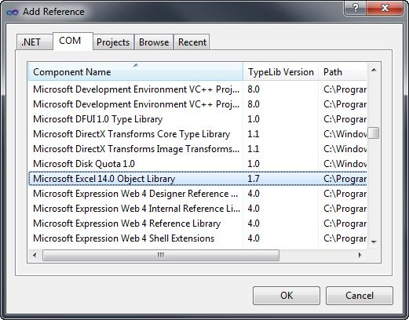
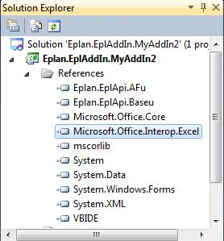

# Using other applications

The current topic describes, how you can use other applications, like Microsoft Excel in your EPLAN API add-in.

If you want to access data of an other program, the application needs to have a suitable interface. Because an EPLAN add-in is written in managed code (C# or `VB.Net`), you need to be able to set a reference to the other program. Either the other application already exposes its interface as .Net assembly, or the .Net framework creates an interop assembly from a COM type library.

The following example shows the use of Microsoft Excel 2003. Excel exposes its functions as COM interface. In your EPLAN add-in, you can add a Reference to the registered type library of Excel:



After you added the reference, the development environment creates an interop assembly. The types of this assembly then can be used in managed code (C# etc.):



In your application code, the use of Excel would look like in the following example:

=== "C#"

    ```csharp
    Excel.ApplicationClass oExcel= new Excel.ApplicationClass();
    oExcel.Visible=true;
    new Decider().Decide(EnumDecisionType.eOkDecision, "Now Excel should be visible!" ,"", EnumDecisionReturn.eOK, EnumDecisionReturn.eOK);
    Excel.Workbooks iWorkBooks=oExcel.Workbooks;
    Excel.Workbook  iWorkBook= iWorkBooks.Add(Excel.XlWBATemplate.xlWBATWorksheet);
    Excel.Worksheet iSheet = (Excel.Worksheet)oExcel.ActiveSheet;
    new Decider().Decide(EnumDecisionType.eOkDecision, "All project messages are now written into an Excel worksheet!", "", EnumDecisionReturn.eOK, EnumDecisionReturn.eOK);
    Check oCheck = new Check();
    oCheck.VerifyProject(oProject);
    PrjMessagesCollection colPrjMsg = new PrjMessagesCollection(oProject);
    PrjMessagesEnumerator itPrjMsg = colPrjMsg.GetPrjMsgEnumerator();
    itPrjMsg.MoveNext();
    int nNr=1;
    do
    {
       ProjectMessage oPrjMsg = itPrjMsg.Current as ProjectMessage;
       if (oPrjMsg != null)
       {
           nNr++;
           iSheet.Cells[nNr, 1] = oPrjMsg.GetGroup().ToString() + GetId().ToString();
           iSheet.Cells[nNr, 2] = oPrjMsg.GetText();
       }
    } while(itPrjMsg.MoveNext());

    new Decider().Decide(EnumDecisionType.eOkDecision, "Action completed!", "", EnumDecisionReturn.eOK, EnumDecisionReturn.eOK);
    oExcel.Quit();
    ```

=== "VB"

    ```vb
    Dim oExcel As New Excel.ApplicationClass()
    oExcel.Visible = True
    Dim dec As Decider = New Decider
    dec.Decide(EnumDecisionType.eOkDecision, "Now Excel should be visible!", "", EnumDecisionReturn.eOK, EnumDecisionReturn.eOK)
    Dim iWorkBooks As Excel.Workbooks = oExcel.Workbooks
    Dim iWorkBook As Excel.Workbook = iWorkBooks.Add(Excel.XlWBATemplate.xlWBATWorksheet)
    Dim iSheet As Excel.Worksheet = CType(oExcel.ActiveSheet, Excel.Worksheet)
    dec.Decide(EnumDecisionType.eOkDecision, "All project messages are now written into an Excel worksheet!", "", EnumDecisionReturn.eOK, EnumDecisionReturn.eOK)
    Dim oCheck As New Check()
    oCheck.VerifyProject(oProject)
    Dim colPrjMsg As New PrjMessagesCollection(oProject)
    Dim itPrjMsg As PrjMessagesEnumerator = colPrjMsg.GetPrjMsgEnumerator()
    itPrjMsg.MoveNext()
    Dim nNr As Integer = 1
    Do
       Dim oPrjMsg As ProjectMessage = itPrjMsg.Current
       If Not (oPrjMsg Is Nothing) Then
          nNr += 1
          iSheet.Cells(nNr, 1) = oPrjMsg.GetGroup().ToString() + GetId().ToString()
          iSheet.Cells(nNr, 2) = oPrjMsg.GetText()
       End If
    Loop While itPrjMsg.MoveNext()
    dec.Decide(EnumDecisionType.eOkDecision, "Action completed!", "", EnumDecisionReturn.eOK, EnumDecisionReturn.eOK)
    oExcel.Quit()
    ```

Excel is started as a separate process. The only object, you create with new is `Excel.ApplicationClass`. All other objects like `Excel.Workbook`, are created -- or queried from Excel -- through functions of the Application object.

Each call of Excel functions is a communication between processes!
