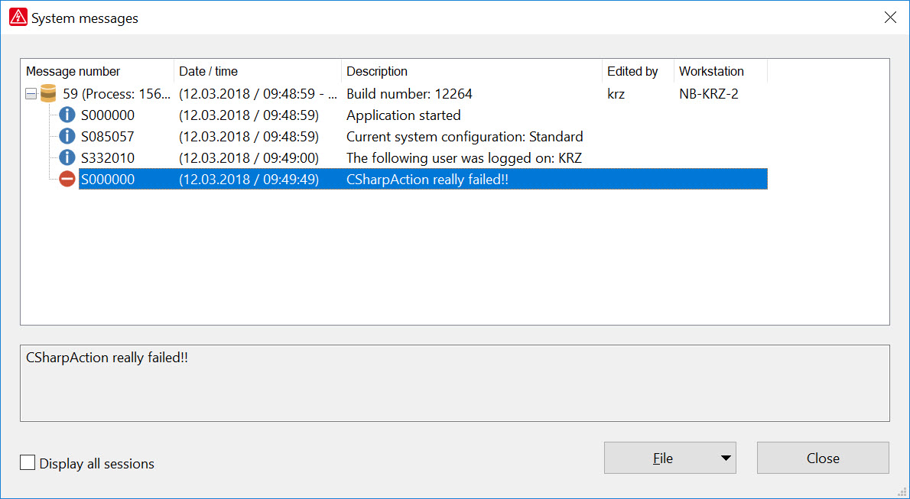

# Writing system messages

EPLAN expects, that system errors are treated by exceptions. Because of this the interface to the EPLAN system messages is implemented in the BaseException class. This means, in order to write a system message you first need to create a BaseException object. However the exception does not need to be thrown! 

By the `fixMessage()` function of the exception, the message is added to the EPLAN system messages. 

=== "C#"

    ```csharp
    Eplan.EplApi.Base.BaseException exc= new Eplan.EplApi.Base.BaseException("CSharpAction really failed!!",
                                    Eplan.EplApi.Base.MessageLevel.Error);
    exc.FixMessage();
    ```

=== "VB"

    ```vb
    Dim exc As Eplan.EplApi.Base.BaseException = New ("CSharpAction really failed!!", _
                                                  Eplan.EplApi.Base.MessageLevel.Error)
    exc.FixMessage
    ```


