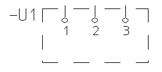
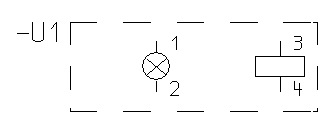
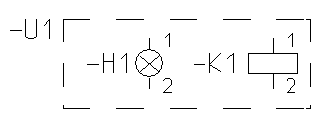

# Черные ящики: Возможности использования

Наиболее часто черный ящик используется в следующих случаях:

* Выводы устройства в черном ящике:
Одна или несколько функций должны быть реализованы не посредством готового символа, а при помощи черного ящика с выводами устройства; при этом следует также показать логическую информацию (напр., для представления внутренней коммутационной схемы).
Пример — так называемый "Черный ящик". Такой вид представления часто используется для устройств, содержимое / функция которых неизвестны или должны оставаться неизвестными.

* Символы без ОУ в черном ящике (представление вывода устройства):
Если одна или несколько функций должны быть реализованы не за счет символа, а за счет символа устройства с одним или несколькими символами. Т. е. выводы устройств представлены не (или не только) выводами устройств, но и символами. В этом случае также должна учитываться логическая информация.

* Символы с ОУ в черном ящике (вложение):
Если разные устройства должны быть объединены в одну группу (единицу). Таким образом обеспечивается возможность вкладывания нескольких таких единиц друг в друга, т. е. обеспечивается функция вкладывания. Такие единицы можно или купить в готовом виде, или изготовить их самостоятельно. Некоторые предприятия запланировали много стандартных функций в готовых модулях, серийное производство которых сможет обеспечивать, например, обученный персонал.

Но так как вложение не всегда желательно, для определенных групп функций (напр., все устройства, только для клемм) его можно отключить.

**См. также:**

* [Черные ящики: Принцип работы](blackbox_k_arbeitsweise.md)
* [Черные ящики: Основные положения для вкладывания](blackbox_k_schachteln.md)
