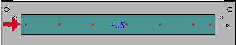
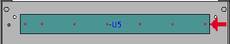
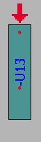
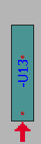

# Диалоговое окно Настройки: Исходная точка

Вы открыли проект. Параметры > Настройки > Проекты > "Имя проекта" > Механическая обработка > Исходная точка.

В этом диалоговом окне задаются настройки для исходной точки при расчете схем сверления на функциональных элементах с переменной длиной. Эти настройки применяются при экспорте данных изготовления для машин ЧУ, что позволяет задавать значительно более широкий спектр машин для автоматизации производственного процесса.

Исходная точка обозначает сторону функционального элемента, на основе которой рассчитывается схема его сверления. Различные машины ожидают заданных параметров начальной точки для обработки функционального элемента в разных положениях. Поэтому необходимо адаптировать настройку к используемой машине в соответствии с требованиями проекта. Для горизонтального и вертикального размещения имеются отдельные настройки. Эти настройки недоступны для функциональных элементов, размещаемых в других угловых положениях.

Обзор основных элементов диалогового окна:

### Исходная точка при горизонтальном расположении функционального элемента

* Слева: схема сверления рассчитывается начиная с левой стороны (стандарт) функционального элемента.

* Справа: схема сверления рассчитывается начиная с правой стороны функционального элемента.

### Исходная точка при вертикальном расположении функционального элемента

* Вверху: схема сверления рассчитывается начиная с верхней стороны (стандарт) функционального элемента.

* Внизу: схема сверления рассчитывается начиная с нижней стороны функционального элемента.

