# Диалоговое окно Пространство листа — <Имя проекта>

* Пространство листа > Навигатор
* Вставить > Графика > Обзор модели / 2D-отображение отверстий / Развертка шины > Основной функциональный элемент
* Вставить > Графика > Обзор модели > Отобразить / скрыть
* Обработать > Устройства > Автоматическая интерпретация

В этом диалоговом окне пространства листов с размещенными устройствами выводятся в логической структуре.

Объем и содержание отображения устройств в виде дерева или списка различается для разных диалоговых окон, в которых используются эти представления. Это также относится к объему и содержанию всплывающего меню:

* Диалоговое окно Выбор 3D-объекта
* Диалоговое окно Отобразить / скрыть 3D-объекты
* Диалоговое окно Выбрать шаблон интерпретации (специфический для проекта)

Обзор основных элементов диалогового окна:

### Фильтр

В этом раскрывающемся списке отображаются все доступные фильтры. Выбранный фильтр активируется автоматически и применяется как к дереву, так и к списку. Запись "- Не активировано -" отключает фильтр и приводит к тому, что данные отображаются в неотфильтрованном виде. С помощью кнопки ++...++ откройте диалоговое окно [Фильтр](modaldialogsdb_d_filternnach.md). Здесь можно создать, обработать, удалить, скопировать, экспортировать, импортировать фильтр и управлять им.

Во всплывающем меню раскрывающегося списка Фильтр содержатся следующие записи:

* Выключить: Этот пункт меню доступен, если фильтр установлен: Сбрасывает настройку фильтра до записи "- Не активировано -".
* Активировать <Имя фильтра>: Этот пункт меню доступен, если для настройки фильтра установлено значение "- Не активировано -": Повторно активирует последний активный фильтр.

Таким образом можно быстро переключаться между неотфильтрованным и отфильтрованным в соответствии с требованиями пользователя представлениями.

### Значение: <Свойство>

При помощи [быстрого ввода](modaldialogsdb_k_filter.md) в данном поле для определенного и активированного фильтра можно быстро изменить значение его критерия.

### Дерево

Показывает все устройства, имеющиеся в пространствах листов открытого проекта. Самый верхний уровень иерархии составляют пространства листов. Под пространством листа в иерархическом порядке расположены содержащиеся в нем устройства: Начиная с монтажной платы или вышестоящего электрошкафа все устройства выводятся под тем функциональным элементом, на котором они размещены.

По умолчанию выводится не обозначение устройства, а обозначение функционального элемента с предшествующим знаком группирования. Если, например, размещена монтажная плата, то предшествующий знак группирования 'MP<Номер монтажной платы>' будет перенесен на все находящиеся ниже функциональные элементы и отображен перед их текстами обозначений. Таким образом в древовидной структуре навигатора в любое время можно распознать, к какой монтажной плате или какому электрошкафу относится то или иное размещение изделия.

Различные пиктограммы в древовидном представлении наглядно показывают, к какому виду относятся рассматриваемые компоненты и в каком состоянии они находятся:

Пиктограмма |  Пиктограмма |  Значение
---|---|---
***Выводится***  |  ***Не выводится***  |
{: .ui-icon } |  - |  Пространство листа
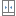{: .ui-icon } |  {: .ui-icon } |  Электрошкаф
{: .ui-icon } |  {: .ui-icon } |  Перфорированный профиль
{: .ui-icon } |  {: .ui-icon } |  Лист для стенки
{: .ui-icon } |  {: .ui-icon } |  Дверь
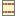{: .ui-icon } |  {: .ui-icon } |  Монтажная плата
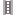{: .ui-icon } |  {: .ui-icon } |  Несущая шина
{: .ui-icon } |  {: .ui-icon } |  Кабельный канал
{: .ui-icon } |  {: .ui-icon } |  Размещение изделия
{: .ui-icon } |  {: .ui-icon } |  Запретная зона для размещения / запретная зона для сверления
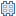{: .ui-icon } |  {: .ui-icon } |  Монтажное отверстие
{: .ui-icon } |  - |  Объекты-заполнители
{: .ui-icon } |  - |  Отдельный объект-заполнитель
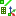{: .ui-icon } |  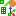{: .ui-icon } |  Инструмент для монтажных работ
{: .ui-icon } |  {: .ui-icon } |  Вспомогательная линия
{: .ui-icon } |  {: .ui-icon } |  Исходная точка
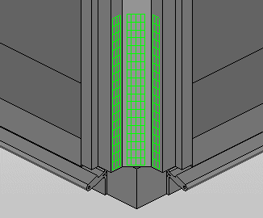 |  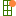{: .ui-icon } |  Монтажная сетка
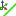{: .ui-icon } |  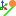{: .ui-icon } |  Линия монтажа
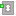{: .ui-icon } |  {: .ui-icon } |  Точка монтажа
***Активировано автоматически***  |  ***Активировано напрямую***  |
{: .ui-icon } |  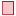{: .ui-icon } |  Монтажная поверхность

Графика представляется в трехмерной области отображения пространства листа. Каждый уровень иерархии при этом может быть представлен отдельно. Несмотря на то что работа в навигаторе пространств листов не привязана к страницам проекта, здесь имеется возможность предварительного просмотра графики.

### Список

Показывает все устройства, имеющиеся в пространствах листов открытого проекта. Вид и сортировка устройств зависят от конфигурации столбцов, выбранной в диалоговом окне Конфигурировать представление.

### Всплывающее меню

Всплывающее меню дает доступ, в зависимости от типа поля (например, дата, целое число, многоязычный), к пунктам меню, при помощи которых вы можете по необходимости, например, влиять на представление таблиц или обрабатывать значения в полях. Обзор пунктов этого всплывающего меню вы можете найти в разделе [Пункты всплывающего меню](userinterface_m_kontextmenu.md).

Дополнительно здесь представлены следующие пункты всплывающего меню, специфические для данного диалогового окна:

Пункт меню |  Значение
---|---
Создать |  Открывает диалоговое окно Свойства (усл. обозначение): Пространство листа и предлагает возможность вставить новое пространство листа, обозначить его и назначить для него предварительно определенные свойства.
Открыть в новом окне |  Открывает выделенное пространство листа в отдельном окне графической трехмерной области отображения.
Удалить |  Убирает выделенное пространство листа из проекта либо удаляет из навигатора размещенное устройство и находящиеся под ним устройства.

!!! note "Замечание:"

    При удалении пространства листа размещенные функциональные элементы не всегда убираются полностью. Устройство, размещенное и в других местах проекта (например, монтажная плата в схеме соединений), не убирается полностью, — удаляется только размещение в трехмерном чертеже монтажных поверхностей. Сам функциональный элемент сохраняется и может быть размещен снова. Функциональный элемент, размещенный только в пространстве листа (например, несущая шина), при удалении пространства листа убирается полностью.

Обновить главные элементы |  [Обновить главные элементы](cabinetgui_h_hauptbauteileaktualisieren.md)
Обновить размещение изделия |  [Обновить размещение изделия](cabinetgui_h_artikelabmessungenaktualisieren.md)
Заменить изделия |  [Заменить изделия в размещенных изделиях](cabinetgui_h_artikeltauschen.md)
Обработать позицию легенды |  [Обработать позицию легенды](cabinetgui_h_legendenpositionbearbeiten.md)
Перейти к (перекрестная ссылка) |  Заносит перекрестные функции в список Перейти к и открывает его.
Перейти к (все виды представлений) |  Заносит все виды представлений функции (например, на странице схем соединений, странице обзора и странице отчета) в список Перейти к и открывает его.
Перейти к (графика) |  Отображает выделенный объект в Графическом редакторе. В процессе размещения какого-либо функционального элемента предназначенная для этого область будет автоматически активирована, если курсор неподвижно находится над ней в течение одной секунды. Такая активация обозначается изменением цвета и появлением точек захвата 3D.
Прямая активация (только монтажные поверхности) |  [Активировать монтажные поверхности](cabinetgui_h_aktivierenautomatisch.md)
Отмена прямой активации |  [Отмена прямой активации](cabinetgui_h_aktivierenautomatisch.md)
Отобразить |  Определяет, какие содержащиеся в пространстве листа компоненты должны быть отображены:

* Выбор: Отображает все функциональные элементы под выделенным узлом.
* Все: Отображает все входящие в пространство листа компоненты.
* Только монтажные платы
* Только двери.

Скрыть |  Скрывает все содержимое пространства листа или выбранные компоненты. Эту скрытую структуру затем можно целенаправленно отобразить в пункте меню Отобразить > Выбор.
Упрощенное представление |  [Упрощенное представление](cabinetgui_h_bauraumansichten.md) для клеммников и 3D-макросов
Список с предварительным выбором (только дерево) |  Уменьшает число отображаемых элементов, чтобы ускорить ориентирование в представлении в виде списка. Если этот параметр активирован, представление в виде списка вызывается с автоматическим фильтром (предварительный выбор), причем этот фильтр содержит только что выбранные элементы.
Выбрать в дереве (только список) |  Показывает выделенный объект во вкладке Дерево.
Монтажная поверхность (только монтажные поверхности) > Выровнять ось X / Выровнять ось Y |  [Выровнять ось X / Y монтажной поверхности](cabinetgui_h_xyachseausrichten.md)
Монтажная поверхность (только монтажные поверхности) > изменить размер |  [Изменить размер монтажной поверхности](cabinetgui_h_mfgroesseaendern.md)
Размер поля (только монтажные поверхности) |  [Определить размер поля](cabinetgui_h_feldgroesseaendern.md)
Табличная обработка |  Открывает табличную обработку с возможностью обрабатывать свойства выделенных объектов.
Свойства |  Открывает диалоговое окно Свойства (усл. обозначение): ++...++. Позволяет обрабатывать свойства размещения изделия.
Свойства (общие) |  Открывает диалоговое окно Свойства (общие): ++...++. Обеспечивает обработку свойств главной функции и всех ее видов представления.

### Всплывающее меню (Диалоговое окно Выбор 3D-объекта)

Это всплывающее меню доступно в представлении структуры дерева диалогового окна Выбор 3D-объекта, вызываемого из диалоговых окон Обзор модели, 2D-отображение отверстий и Развертка.

Пункт меню |  Значение
---|---
Конфигурировать представление |  Открывает диалоговое окно Конфигурировать представление, в котором можно задать, какие свойства должны отображаться в представлении в виде списка и в представлении структуры дерева.

!!! note "Замечание:"

    Для трех диалоговых окон Пространство листа — <Имя проекта>, Выбор 3D-объекта и Отобразить / скрыть 3D-объекты используется одинаковая конфигурация. При изменении конфигурации представления в виде дерева или списка для одного из этих диалоговых окон это будет иметь действие сразу на все три диалоговых окна.

### Всплывающее меню (Диалоговое окно Отобразить/скрыть 3D-объекты)

Это всплывающее меню доступно в представлении структуры дерева диалогового окна Отобразить/скрыть 3D-объекты, вызываемого из диалогового окна Обзор модели.

Пункт меню |  Значение
---|---
Включить / выключить |  Включение/выключение галочки перед выделенным объектом в представлении структуры дерева. Объекты с активированной галочкой представлены в соответствующем обзоре модели.
Отобразить/скрыть все устройства. |  Скрывает или отображает все устройства ниже выделенного уровня иерархии в соответствующем обзоре модели.

**См. также:**

* [Адаптировать структуру пространства листа](cabinetgui_h_bauraumstrukturanpassen.md)
* [Диалоговое окно Свойства (усл. обозначение): Пространство листа](cabinetgui_d_bauraumeigenschaften.md)
* [Диалоговое окно Трехмерный навигатор монтажных поверхностей](cabinetgui_d_navigator3dschaltschrankaufbau.md)
