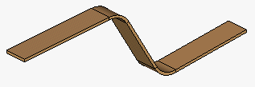
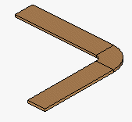

# Диалоговое окно Сборная шина (изогнутая)

Вы открыли проект. Навигатор пространства листов открыт, и одно пространство листов открыто. Вставить > Сборная шина (изогнутая).

В данном диалоговом окне задайте номер изделия сборной шины, профиль шины и радиус изгиба для размещенной сборной шины. В каждом из трех полей необходимо сделать одну запись.

Обзор основных элементов диалогового окна:

### Номер изделия

Кнопка ++...++ открывает диалоговое окно Выбор изделия на ступени иерархии главной группы продуктов "Механика", группы продуктов "Сборные шины", подгруппы продуктов "Шина".

Если выбранное изделие имеет присвоенный макрос с видом представления "Трехмерный чертеж монтажных поверхностей", этот макрос используется для определения размеров ширины и глубины. Если не присвоен ни один макрос, записи из полей Ширина и Глубина используются на вкладке изделия Монтажные данные.

Медные шины, предусмотренные для сгибания, всегда имеют прямоугольное поперечное сечение. Если выбранному изделию уже присвоен контур (Выдавливание) (для составления шины, определенной пользователем), гнуть это изделие нельзя. Такое изделие нельзя использовать для изогнутой медной шины.

### Профиль

Если выбранное изделие имеет присвоенный макрос с видом представления "Трехмерный чертеж монтажных поверхностей", этот макрос используется для определения профиля и радиуса изгиба. Если не присвоен ни один макрос, в данное поле необходимо занести чертеж профиля.

Кнопка ++...++ открывает диалоговое окно Выбор профиля, в котором можно выбрать файл с расширением *.fp1.

### Радиус изгиба

Укажите здесь необходимый радиус изгиба для мест изгиба медной шины. Данные, указанные в этом поле, заносятся в раскрывающийся список, в котором можно также выбрать значения.

### Плоский изгиб

С помощью этой настройки сборная шина формирует изгиб вокруг ребра, который в данных изделия определяется значением "Ширина".

### Изгиб на ребро

С помощью этой настройки сборная шина формирует изгиб вокруг ребра, который в данных изделия определяется значением "Глубина". Для изгиба на ребро требуется значительно больший радиус, чем для плоского изгиба.

**См. также:**

* [Размещение медной шины](copper_h_kupferschieneplatzieren.md)
