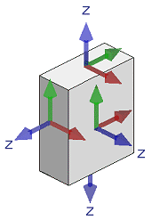
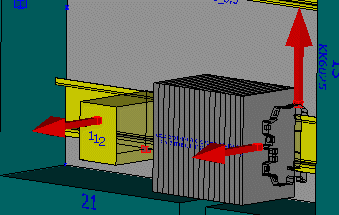
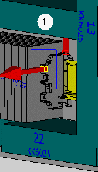
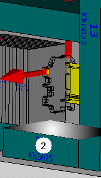
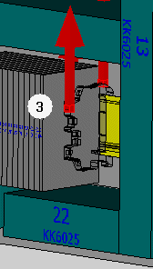

# Определить схему соединений в пространстве листа

Чаще всего размещения изделий получают информацию о существующих выводах устройства из определения схемы соединений изделия. Если в свойствах размещения изделия на вкладке Схема соединений установлен флажок Локальная схема соединений, то определенные на изделии выводы устройства копируются на размещение изделия. После этого привязка к данным изделия отменяется и выводы устройства можно редактировать по отдельности.

Если размещенное изделие не имеет заданных выводов устройства, то можно определить выводы графически на размещении изделия. Эти графические выводы устройства также локальны и действительны для обрабатываемого размещения изделия. Как и все локальные выводы устройства, графически определенные выводы можно изменять индивидуально (позиция, направление вывода устройства). Измененные данные локальных выводов устройства также можно использовать позднее для переноса их на схемы соединений в базе данных изделий.

!!! note "Замечание:"

    * При работе с несколькими вариантами изделия, имеющими схему соединения, следует настраивать их отдельно при каждой маршрутизации на вкладке Шаблоны функций. Более подробную информацию об этом можно найти [здесь](partsmanagementgui_r_funktionsschablone.md).
    * При указании выводов устройства следует следить за тем, чтобы они находились в рамках геометрических размеров устройства. Если выводы устройства выходят за рамки устройства, соединения не будут маршрутизированы.

Условия:

* Вы открыли проект.
* Навигатор пространства листов открыт, и одно пространство листов открыто.
* В пространстве листа находятся трехмерные размещения изделия.

### Графическое определение выводов устройства

1. Выберите пункты меню Вид > Обозначения выводов устройств и Вид > Направление выводов устройства.

!!! info "Для сведения:"

    Заданные и заново определенные выводы размещений изделий представлены в виде красного параллелепипеда.

2. Выберите команды меню Обработать > Логика устройства > Схема соединений > Определить вывод устройства.

!!! info "Для сведения:"

    Потребуется выбрать поверхность, которая должна определить направление вывода устройства. Это может быть любая поверхность функционального элемента.

!!! info "Для сведения:"

    Выравнивание выбранной поверхности по оси Z определяет направление вывода устройства. Выравнивание поверхности по оси Z всегда направлено перпендикулярно нижней поверхности.

3. Поместите курсор над поверхностью, с помощью которой вы хотите определить направление вывода устройства.

!!! info "Для сведения:"

    Поверхность будет выделена цветом.

4. Щелкните по нужной поверхности.

!!! info "Для сведения:"

    Вывод устройства отображается в виде красного параллелепипеда и прикрепляется к курсору.

!!! info "Для сведения:"

    Затем необходимо определить вывод устройства в пространстве листа. Для этого выберите точку, в которой будет размещен вывод устройства.

5. Переместите курсор над трехмерной геометрической фигурой.

!!! info "Для сведения:"

    Отображаются трехмерные точки привязки объекта; но вывод устройства может быть размещен также и вне трехмерных точек.

!!! info "Для сведения:"

    Удерживая клавишу ++Ctrl++, вы можете щелкнуть мышью на две точки, чтобы установить середину между этими точками. Так вывод устройства можно разместить также в центре в прямоугольных отверстиях.

6. Во всплывающем меню выберите пункт [Опции размещения](cabinetgui_d_platzieroptionen.md), чтобы задать размещению вывода устройства смещение по осям X, Y и Z.
7. Щелкните по требуемой точке.

!!! info "Для сведения:"

    В диалоговом окне Свойства на вкладке Схема соединений появится новая строка, содержащая в столбцах Позиция X, Y и Z координаты данных точек.

!!! info "Для сведения:"

    Столбцы Вектор X, У и Z определяют направление вывода устройств. Значения задают преимущество, с которым вектор указывает в направлении соответствующей оси. При первом размещении вывода устройства только Z-выравнивание выбранной поверхности определяет направление вывода устройства, поэтому здесь вводится значение X = 0, Y = 0, Z =1.

8. Если вывод устройства необходимо обратить в другом направлении, измените значения вектора. Примеры этих действий приведены [здесь](devicetaggui_r_anschlussbild.md).
9. Введите в поле Обозначение вывода устройства нового вывода устройства обозначение.
10. В поле Направление подсоединения выберите нужное направление, в котором маршрутизируемое соединение будет преимущественно искать вход в сеть соединенных сегментов после выхода из вывода устройства.
11. При необходимости укажите в других полях остальные свойства вывода устройства.
12. Щелкните по кнопке ++OK++.

!!! info "Для сведения:"

    Новый вывод устройства появляется на размещении изделия в выбранном месте в виде красного параллелепипеда.

!!! info "Для сведения:"

    Обозначение вывода устройства отображается на передней стороне параллелепипеда.

!!! info "Для сведения:"

    Направление вывода устройства показано с помощью красной стрелки.

### Изменить направления выводов устройства

1. Для изменения направлений выводов устройства выберите пункт меню Вид > Направления выводов устройства.

!!! info "Для сведения:"

    Отображаются все векторы выводов устройства.

2. Чтобы изменить все направления выводов устройства данного функционального элемента, выделите весь функциональный элемент. Чтобы изменить только направление данного вывода устройства, выделите отдельный вывод устройства (1).

3. Выберите команды меню Обработать > Логика устройства > Схема соединений > Изменить направление вывода устройства.
4. На размещении изделия выберите поверхность, к Z-выравниванию которой следует адаптировать направления выводов устройства (2).

!!! info "Для сведения:"

    Направление данного вывода устройства адаптируется к Z-выравниванию выбранной поверхности (3).

**См. также:**

* [Вкладка Схема соединений (Размещение изделия 3D)](devicetaggui_r_anschlussbild.md)
* [Показать выводы устройства графически](routinggui_h_anschlussansicht.md)
* [Перенос локальной схемы соединений в базу данных изделий](cabinetgui_h_anschlussbildnachartvw.md)
