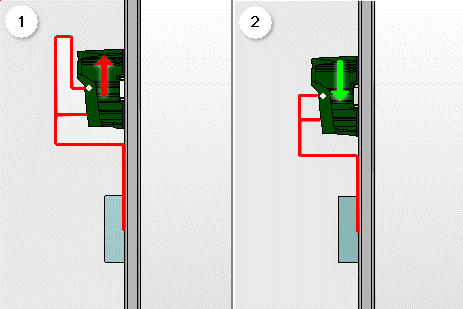

# Изменить направление подсоединения

В зависимости от ситуации с установкой устройства в электрошкафу может возникнуть необходимость в изменении указанного в схеме соединений направления подсоединения всех выводов устройств, чтобы таким образом избежать неудобных трасс маршрутизации.

В качестве примера особой ситуации с установкой выступает размещение автомата защиты двигателя на адаптере устройства, который сам размещен на системе сборных шин. Все размещение, как правило, осуществляется на верхнем крае монтажной платы. Разводка всех соединений автомата защиты двигателя осуществляется в этом случае вниз в кабельный канал. Если при этом направление подсоединения выводов устройств в схеме соединений указано в верхнем направлении (1), при маршрутизации соединений приходится прокладывать обходные и более длинные трассы маршрутизации. В случае изменения направления подсоединений вниз удалось бы значительно сократить трассы маршрутизации (2).

Для возможности реагирования на такие ситуации можно быстро и на длительный срок изменить направление подсоединений для одного или нескольких выделенных устройств в пространстве листа. Это изменение локально переписывает настройки изделия. Настройки направлений подсоединений в схеме соединений изделия в этом случае будут больше не действительны для данных устройств.

Условия:

* Вы открыли проект.
* Навигатор пространства листов открыт, и одно пространство листов открыто.
* Пространство листа содержит трехмерные размещения изделий с определенными выводами устройства.

1. Выделите в пространстве листа устройство, для которого требуется изменить направление подсоединения.
2. Выберите пункты меню Данные проекта > Устройство > Изменить направление подсоединения.
3. В диалоговом окне Изменить направление подсоединения выберите в раскрывающемся списке ***новое*** направление подсоединения.

!!! info "Для сведения:"

    Задавать параметры можно для аналогичных направлений подсоединений, которые присутствуют также при составлении схемы соединений.

4. Щелкните по кнопке ++OK++.

!!! info "Для сведения:"

    Параметры для нового направления подсоединения задаются на всех выводах выделенных устройств.

!!! info "Для сведения:"

    В диалоговом окне "Свойства" устройств видны новые направления подсоединения на вкладке Схема соединений. Флажок Локальная схема соединений установлен.

При снятии флажка Локальная схема соединений направления соединения будут возвращены к настройкам первоначальной схемы соединений изделия.

**См. также:**

* [Диалоговое окно Изменить направление подсоединения](routinggui_d_verlegerichtungaendern.md)
