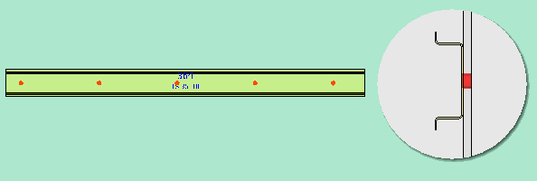

# Изменить трехмерный вид пространства листа

Вид открытого пространства листа можно изменить при помощи различных функций.

Условия:

* Вы открыли проект.
* Навигатор пространства листа открыт, и открыто пространство листа.

Данная функция позволяет увеличить или уменьшить представленное в трехмерном виде пространство листа или изображенные отдельно компоненты (монтажную плату, несущую шину и т. д.).

1. Выберите пункт меню Вид > Фрагмент > Увеличить / уменьшить.

!!! info "Для сведения:"

    Отображаемый вид будет пошагово увеличен или уменьшен относительно позиции в системе координат.

2. Задержите курсор над трехмерным видом и вращайте колесико мыши вперед или назад.

!!! info "Для сведения:"

    Отображаемый вид будет пошагово увеличен или уменьшен относительно позиции курсора.

Данная функция позволяет сгенерировать различные ортогональные (сверху, снизу, слева, справа, спереди или сзади) или [изометрические (с юго-запада, юго-востока, северо-востока, северо-запада) виды](gededit3dgui_k_start.md) пространства листа. Обозначения четырех изометрических точек наблюдения указывают сторону света, с которой рассматривается модель. Кроме того, угол зрения повернут на 60° вниз.

1. Выберите пункты меню Вид > Точка наблюдения 3D.

2. В подменю выберите один из доступных видов.

!!! note "Замечание:"

    При переключении трехмерной точки наблюдения вид поворачивается и принимает новое положение. Пользовательская настройка [Поворачивать при изменении точки наблюдения](gedviewer_d_einstellungenbenutzerallgemein3d.md) позволяет отключать данную анимацию, в этом случае точка наблюдения изменяется без поворота.

!!! tip "Совет:"

    Для изменения точки наблюдения 3D можно также воспользоваться комбинацией клавиш. Возможные комбинации клавиш указаны в подменю Вид > Точка наблюдения 3D и в разделе справки [Обзор комбинаций клавиш](gededitgui_k_tastaturbefehle.md). Вы также можете назначить эти комбинации клавиш для функциональных клавиш мыши Spacemouse.

Данная функция позволяет движениями мыши изменить угол зрения на графику.

1. Выберите пункт меню Вид > Повернуть угол зрения.

2. Щелкните по трехмерному виду и удерживайте нажатой левую кнопку мыши.
3. Переместите мышь с нажатой кнопкой в направлении, в каком необходимо изменить угол зрения.

!!! info "Для сведения:"

    Представление в пространстве листа последует за указателем мыши и будет повернуто в соответствующем направлении.

Данная функция позволяет уменьшить детализацию графики размещенных в пространстве листа изделий. Функциональные элементы, которые должны быть представлены упрощенно, задаются в диалоговом окне [Настройки: 3D](gedviewer_d_einstellungenbenutzerallgemein3d.md):

* Клеммники (Определение блока)
* 3D-макросы.

Эти настройки применяются ко всем уже размещенным функциональным элементам и ко всем функциональным элементам, размещаемым позднее.

1. Выберите в навигаторе пространств листов пункт всплывающего меню Упрощенное представление.

!!! info "Для сведения:"

    ***3D-макросы*** будут замещены прямоугольными объектами, размеры которых соответствуют размерам используемых ранее функциональных элементов. ***Клеммники*** будут объединены в один блок, отдельные клеммы не представляются. Вместо маркировки отдельных клемм отображается маркировка клеммников. Позиция компонентов, размещенных на этих функциональных элементах, не изменяется.

Предварительно настроенные цвета для фона трехмерного вида можно отрегулировать по отдельности. При этом можно выбрать один цвет или два, между которыми будет сгенерирован горизонтальный градиентный переход.

1. Выберите пункты меню Параметры > Настройки > Пользователь > Графическая обработка > 3D.

2. В групповом поле Выбор цвета в полях Фон оттенения 1 и Фон оттенения 2 нажмите кнопку ++...++, чтобы открыть диалоговое окно [Выбор цвета](mf_d_farbauswahl.md).
3. Выберите необходимые цвета.

!!! info "Для сведения:"

    Если выбрано два различных цвета, фон будет изображен с градиентным переходом цветов. Первый цвет определяет начальный цвет в верхней части окна, второй цвет — конечный цвет в нижней части окна.

!!! info "Для сведения:"

    Если выбрано два одинаковых цвета, фон будет изображен однотонным.

Под ***Отобразить отверстия*** понимается отображение всех шагов механической обработки (конструкции). Сюда не относятся монтажные отверстия, размещенные вручную.

1. Выберите пункты меню Вид > Отобразить отверстия.

!!! info "Для сведения:"

    Прозрачность всех размещений изделий настроена на 50 %. Все сохраненные в изделии схемы сверлений отображаются на монтажных поверхностях, на которых они размещены. Визуализированные схемы сверления полностью пропускают расположенные ниже компоненты сверления, что четко видно на виде сбоку.

2. Снова выберите пункты меню Вид > Отобразить отверстия, чтобы скрыть отверстия.

**См. также:**

* [Диалоговое окно Свойства (усл. обозначение): Пространство листа](cabinetgui_d_bauraumeigenschaften.md)
* [Диалоговое окно Пространство листа — <Имя проекта> / Диалоговое окно Выбор 3D-объекта / Диалоговое окно Отобразить / скрыть 3D-объекты / Диалоговое окно Выбрать шаблон интерпретации (специфический для проекта)](cabinetgui_d_navigator.md)
