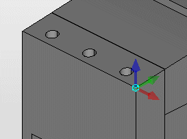

# Определить исходную точку

Пользовательские исходные точки — это размещенные пользователем вручную в макросе точки монтажа с заранее определенными свойствами, которые можно использовать в базе данных принадлежностей в качестве свойства размещения принадлежностей. С помощью них можно настроить места для размещения макроса в качестве детали принадлежности на перфорированном профиле и корпусе.

!!! note "Замечание:"

    * Точки монтажа или исходные точки также можно размещать на монтажных поверхностях или монтажных сетках.
    * Впоследствии для выравнивания и поворота точки вставки можно воспользоваться функцией [Повернуть вокруг оси](cabinetgui_h_drehenxyz.md).

Условия:

* Вы открыли проект.
* Навигатор пространства листов открыт, и одно пространство листов открыто.
* Пространство листа содержит импортированные трехмерные тела, которые необходимо сохранить в виде макроса.
* Включен захват объекта.

1. Выберите пункты меню Обработать > Логика устройства > Исходные точки.
2. Переместите курсор над трехмерной геометрической фигурой.

!!! info "Для сведения:"

    На объекте будут показаны точки захвата 3D красным цветом. Это конечные или серединные точки ребер или угловые точки параллелепипеда, обрамляющего объект.

3. Щелкните мышкой по точке на нужной поверхности.

!!! info "Для сведения:"

    Определяемая точка вставки будет видна на курсоре благодаря пересечению координатных осей.

4. С помощью комбинации клавиш [Ctrl] \+ [Shift] \+ [R] можно поворачивать ось X точки вставки под прямым углом с шагом 90°.
5. Выберите пункт всплывающего меню Опции размещения, чтобы в диалоговом окне [Опции размещения](cabinetgui_d_platzieroptionen.md) задать произвольный угол вращения для оси X и / или смещение в направлении X, Y и Z.
6. Щелкните по требуемой точке.

1. В диалоговом окне Свойства занесите нужные значения в поля Имя и Описание.
2. Щелкните по кнопке ++OK++.

!!! info "Для сведения:"

    Исходная точка размещается в виде цианового параллелепипеда с трехмерной системой координат в выбранном месте.

!!! note "Замечание:"

    Если в обрабатываемом макросе уже содержится исходная точка с идентичным именем, отобразится сообщение. Вы можете разместить исходную точку или отменить размещение, выбрав [Нет]. В последнем случае диалоговое окно "Свойства" останется открытым, а вы сможете выбрать другое имя для исходной точки.

**См. также:**

* [Исходные точки: Принцип](cabinetgui_k_bezugspunkte.md)
* [Перенести схему расположения точек вставки](cabinetgui_h_bezugspunktschemauebertragen.md)
* [Отображение инструмента для монтажных работ](cabinetgui_h_montagehilfenanzeigen.md)
