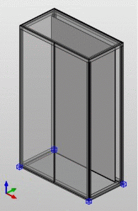

# Перенести схему расположения точек вставки

При создании электрошкафов серии Rittal 'TS8', 'AE' и 'CM', которые были импортированы в пространство листа в виде файлов STEP, существует возможность автоматического размещения исходных точек в соответствии с серией электрошкафа.

Условия:

* Вы открыли проект макросов.
* Навигатор пространства листов открыт, и одно пространство листов открыто.
* Пространство листа содержит импортированную трехмерную графику, которую необходимо сохранить в качестве электрошкафа.
* Четыре боковых вертикальных профиля, а также верхний и нижний профиль имеют соответствующее определение функции и обозначение функциональных элементов.

1. Выделите трехмерную графику в пространстве листа или в навигаторе пространства листа.
2. Выберите пункты меню Обработать > Логика устройства > Перенести схему расположения точек вставки.
3. Активируйте в диалоговом поле Перенести схему расположения точек вставки зависимую кнопку перед названием серии шкафа, схему расположения точек вставки которого необходимо перенести на трехмерную графику.
4. Щелкните по кнопке ++OK++.

!!! info "Для сведения:"

    Исходные точки выбранной серии электрошкафа автоматически определяются на трехмерной графике.

**См. также:**

* [Исходные точки: Принцип](cabinetgui_k_bezugspunkte.md)
* [Определить исходную точку](cabinetgui_h_bezugspunktdefinieren.md)
