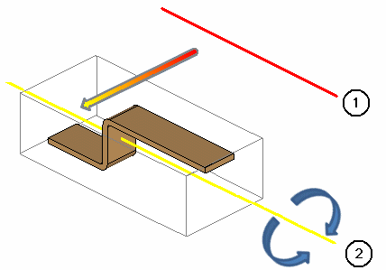

# Повернуть объекты вокруг оси

Функция Повернуть вокруг оси поворачивает один или несколько объектов в пространстве листа (например, трехмерное тело, импортированное из файлов STEP) вокруг центра описанного вокруг них невидимого параллелепипеда. В качестве оси вращения можно использовать ребра, вспомогательные линии либо ось точки монтажа или исходной точки. Благодаря этому можно поворачивать 3D-объекты независимо от системы координат пространства листа, в т. ч. и вокруг неортогональных линий и ребер.

На следующем рисунке показан принцип работы вращения: Выбранная ось вращения (1) проецируется в центр описанного параллелепипеда. В дальнейшем вокруг этой спроецированной оси (2) будет производиться вращение.

Для поворота 3D-объектов вокруг осей, ребер или линий необходимо выполнить 4 подготовительные операции:

* Выбрать поворачиваемые объекты
* Определить ось вращения
* Определить направления вращения на оси вращения
* Ввести угол поворота.

Условия:

* Вы открыли проект.
* Навигатор пространства листов открыт, и одно пространство листов открыто.

1. Выберите пункты меню Вид > Инструмент для монтажных работ.

!!! info "Для сведения:"

    Отображаются точки монтажа и исходные точки, а также их системы координат 3D.

!!! info "Для сведения:"

    Оси X, Y и Z систем координат можно использовать в качестве осей вращения.

2. Выберите пункты меню Обработать > Графика > Повернуть вокруг оси.
3. Переместите с помощью мыши рамку вокруг поворачиваемого объекта или объектов.
4. При помощи ввода следующих данных вы определяете ось вращения, вокруг которой должен выполняться поворот. Дотроньтесь курсором до любой оси, ребра или линии в пространстве листа.

!!! info "Для сведения:"

    Ось, ребро или линия, к которой прикоснулся курсор, выделяются светлым.

5. Щелкните по нужной оси, линии или ребру.
6. Следующие введенные данные определяют, в каком направлении должен вращаться объект вокруг оси вращения. Щелкните на конечную точку ребра или линии, установленной как ось вращения.

!!! example "Пример:"

    Выбранная ось вращения: Ребро Начальная точка оси вращения Результат Слева Поворот налево Справа Поворот направо

7. В области ввода данных укажите угол поворота.

!!! note "Замечание:"

    В зависимости от настройки область ввода данных либо сразу появляется рядом с курсором, либо после ввода первой цифры. Чтобы область ввода данных в 3-мерном виде всегда отображалась для любого возможного ввода, выберите пункты меню Параметры > Настройки > Пользователь > Графическая обработка > Область ввода данных и установите флажок Всегда отображать область ввода данных (3D).

!!! example "Пример:"

    Ось вращения Поворот Результат Ребро Линия

!!! example "Пример:"

    Ось вращения Поворот РезультатXYZ
