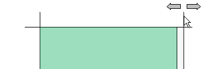

# Определить размер поля монтажных поверхностей

'Размер поля' определяет величину монтажной поверхности, релевантной для ЧУ, с производственно-технической точки зрения. Станки ЧПУ определяют координаты необходимых отверстий и фрезеровки, исходя из точки, принятой за начало координат, через которую должна проходить поверхность, подлежащая обработке. Поэтому обращайте внимание, установлена ли монтажная плата в сверлильный станок вместе со своими функциональными элементами, или эти функциональные элементы были предварительно убраны. По поводу размера поля в машину вводится информация о величине обрабатываемого функционального элемента и о том, где находится в станке обрабатываемая поверхность.

Условия:

* Вы открыли проект.
* Навигатор пространства листа открыт, и одно пространство листа открыто.
* Поверхности функционального элемента определены как важные для ЧУ монтажные поверхности.

1. В навигаторе пространства листа выберите пункт всплывающего меню Монтажная поверхность > Размер поля.

!!! info "Для сведения:"

    Появятся две вертикальные и две горизонтальные линии, ограничивающие размер поля.

2. Щелкните линии одну за другой и переместите их.

!!! info "Для сведения:"

    После размещения линий размер поля этой монтажной поверхности будет определен заново.

!!! note "Замечание:"

    * При создании макроса с релевантными для ЧУ монтажными поверхностями размер поля не вводится автоматически, а должен определяться вручную.
    * Размер поля можно определить только на монтажных поверхностях, предусмотренных для экспорта ЧУ, например на передней части монтажной платы, задней стенке снаружи, наружной боковой стенке, наружной дверце, передней монтажной поверхности ЧУ, внутренней соединительной плате.

**См. также:**

* [Определить монтажную поверхность](cabinetgui_h_montageflaechedefinieren.md)
