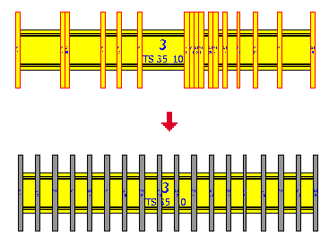
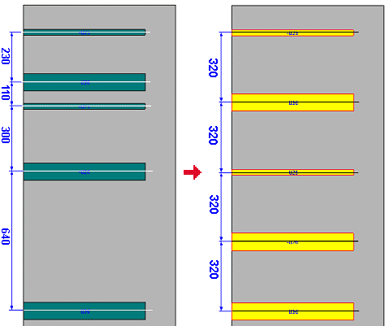

# Равномерное распределение элементов в пространстве листа

С помощью команды Распределить равномерно нескольким выделенным трехмерным размещениям изделий присваивается одинаковый интервал по отношению друг к другу в горизонтальном или вертикальном направлении. Для этого распределяемые 3D-объекты должны лежать на одной общей монтажной поверхности или одной несущей шине. Равномерное распределение объектов, расположенных на различных монтажных поверхностях, нецелесообразно. Поэтому функция распределения отсутствует, если были выделены объекты, расположенные не на одной общей монтажной поверхности или несущей шине.

Условие:

Открыто одно пространство листа. Вы выбрали трехмерную точку наблюдения "Впереди".

1. Выберите соответствующие 3D-объекты и выберите пункты меню Обработать > Другое > Распределить равномерно (горизонтально) или Обработать > Другое > Распределить равномерно (вертикально).

!!! info "Для сведения:"

    EPLAN определяет расстояние между первым и последним 3D-объектом и равномерно распределяет все остальные элементы между ними.

При равномерном распределении кабельных каналов интервалы между ними рассчитываются относительно ***средней оси***, а не относительно зазора между ними. Причина заключается в том, что в случае с кабельными каналами разной ширины зазор может иметь разную величину.

1. Выделите соответствующие кабельные каналы и выберите пункты меню Обработать > Другое > Распределить равномерно (горизонтально) или Обработать > Другое > Распределить равномерно (вертикально).

!!! info "Для сведения:"

    EPLAN определяет расстояние между средней осью первого и последнего кабельного канала и равномерно распределяет все остальные элементы между ними.

!!! note "Замечание:"

    Обратите внимание, что при распределении 3D-объектов сетка не учитывается; при необходимости воспользуйтесь командой Выровнять по сетке, чтобы снова разместить элементы на сетке.

**См. также:**

* [Работа с сетками в пространстве листа](cabinetgui_h_raster.md)
