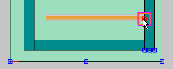
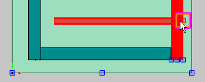

# Использование контроля конфликтов

Контроль конфликтов проверяет, перекрываются или проходят друг через друга функциональные элементы во время размещения или обработки. Он всегда выполняется при размещении, копировании, дублировании, поворачивании или удлинении. Существующие конфликты визуализируются через выделение цветом соответствующих функциональных элементов. Используемый цвет задается через меню Параметры > Настройки > Пользователь > Графическая обработка > 3D.

* Контроль конфликтов охватывает все виды функциональных элементов независимо от того, скрыты они или показаны.
* Контроль конфликтов можно отключить в любое время.
* При размещении функциональных элементов с переменными длины контроль конфликтов устанавливается после указания первой точки размещения.
* Преднамеренные конфликты не обрабатываются как конфликты (например, встроенный в дверь монитор).
* Определенные в изделии безопасные зоны (интервалы установки) анализируются и учитываются через контроль конфликтов.
* Последующая проверка конфликтов выполняется через контрольный прогон.

Например, необходимо использовать контроль конфликтов при вставке несущей шины.

Условия:

* Вы открыли проект.
* Навигатор пространства листов открыт, и одно пространство листов открыто.
* Пространство листа содержит размещения изделия.
* Трехмерный навигатор монтажных поверхностей открыт.

1. Выберите пункты меню Параметры > Контроль конфликтов.
2. Откройте пункт меню Вставить > Несущая шина и выберите несущую шину для размещения.
3. Укажите первую точку размещения и вытяните несущую шину так, чтобы она касалась уже размещенного изделия.

!!! info "Для сведения:"

    Как только оба функциональных элемента соприкоснутся, появятся точки захвата.

4. Далее растяните несущую шину так, чтобы она выступала над уже размещенным изделием.

!!! info "Для сведения:"

    Оба участвующих функциональных элемента контроль конфликтов выделяет цветом. О конфликте сообщается в строке состояния. Ввод второй точки размещения невозможен, размещение несущей шины прекращается.

5. Разместите изделие на подходящем месте.

**См. также:**

* [Диалоговое окно Настройки: 3D](gedviewer_d_einstellungenbenutzerallgemein3d.md)
* [P026011: 3D-графика размещения изделия совпадает с \<x\>.](msg/messages_p_026011.md)
