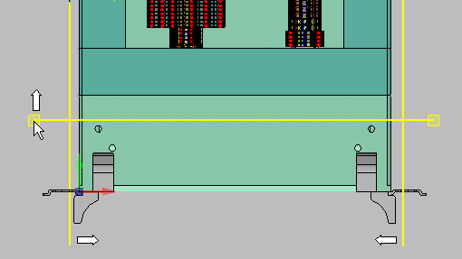
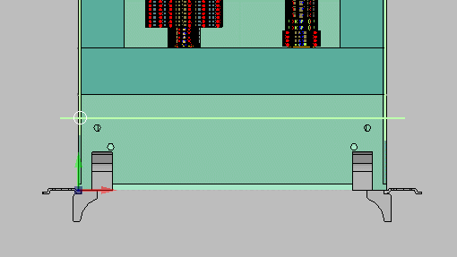

# Изменить размер монтажных поверхностей

После импорта данных STEP можно генерировать монтажные поверхности на импортированных трехмерных телах. Если в импортируемых данных STEP в одном функциональном элементе собраны несколько трехмерных тел (например, монтажная плата и кронштейн), можно ориентировать создаваемую на них монтажную поверхность по границам пристраиваемых элементов. В результате этого нулевая точка монтажной поверхности окажется вне зоны, предусмотренной для размещения. Таким образом, там также можно (хотя нежелательно) размещать устройства.

Во избежание ошибок при размещении устройства, привязанного к нулевой точке монтажной поверхности, можно изменить размер поверхности, предусмотренной под размещение, и таким образом согласовать положение нулевой точки.

Условия:

* Вы открыли проект.
* Навигатор пространства листа открыт, и одно пространство листа открыто.
* Поверхности функционального элемента определены как монтажные поверхности.

1. Выделите монтажную поверхность функционального элемента в навигаторе.
2. В навигаторе выберите пункт всплывающего меню Монтажная поверхность > Изменить размер.

!!! info "Для сведения:"

    Появятся две вертикальные и две горизонтальные линии, ограничивающие размер монтажной поверхности. Нулевая точка всегда располагается слева внизу в точке пересечения левой и нижней линий.

3. Щелкните линии одну за другой и переместите их.

!!! info "Для сведения:"

    После размещения линий размер этой монтажной поверхности будет определен заново.

!!! info "Для сведения:"

    Площадь, предусмотренная для размещения, определена заново; нулевая точка смещена соответствующим образом.

**См. также:**

* [Определить монтажную поверхность](cabinetgui_h_montageflaechedefinieren.md)
* [Выровнять ось X / Y монтажных поверхностей](cabinetgui_h_xyachseausrichten.md)
