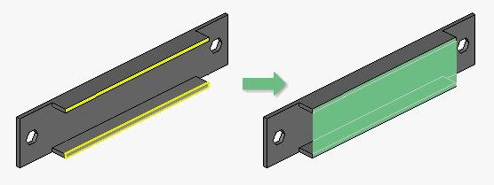
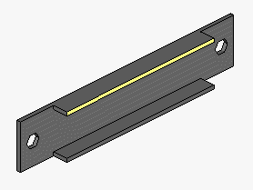

# Определить монтажную поверхность

Поверхности объектов, импортированных в виде трехмерных данных, могут быть определены как ***Монтажная поверхность***. Для этого предусмотрены три возможности:

* Отдельные поверхности могут определяться как отдельные монтажные поверхности.
* При размещении изделий можно определить монтажную поверхность на произвольной поверхности, если на ней отсутствует другая монтажная поверхность.
* Несколько поверхностей, лежащих в одной плоскости, можно объединить в одну монтажную поверхность.

Монтажные поверхности — это поверхности функциональных элементов, на которых могут быть размещены другие компоненты. Они позволяют захватывать точки захвата шин, каналов или компонентов, которые должны быть размещены на них. Монтажные поверхности можно активировать автоматически касанием курсора или выбрать непосредственно из всплывающего меню навигатора пространства листа. Монтажные поверхности можно удалять в навигаторе пространства листа.

Условия:

* Вы открыли проект.
* Навигатор пространства листа открыт, и открыто пространство листа.
* Пространство листа содержит импортированные трехмерные тела, которые необходимо сохранить в виде макроса.

1. Выберите пункты меню Обработать > Логика устройства > Монтажная поверхность.
2. Переместите курсор в область трехмерного тела.

!!! info "Для сведения:"

    Расположенная под курсором поверхность будет автоматически выделена цветом.

3. После выявления требуемой поверхности щелкните по ней мышью.

!!! info "Для сведения:"

    Если за рамками выбранной поверхности в той же плоскости будут найдены и другие поверхности, отобразится сообщение.

!!! info "Для сведения:"

    Дополнительно найденные поверхности в данной плоскости подсветятся желтым.

4. Если вы захотите объединить найденные поверхности одной плоскости в общую монтажную поверхность, щелкните по кнопке ++Да++ в сообщении.

5. Если вы хотите объединить в монтажную поверхность только предварительно выбранные поверхности, щелкните в сообщении по кнопке ++Нет++.

!!! info "Для сведения:"

    Выбранная поверхность будет определена как монтажная поверхность. В навигаторе пространства листа под соответствующим узлом функционального элемента генерируется запись Монтажная поверхность.

!!! info "Для сведения:"

    Отобразится диалоговое окно Свойства данной монтажной поверхности, и в нем можно задать описание функциональных элементов и выбрать дальнейшие свойства.

Для размещения изделий без трехмерного графического макроса, сгенерированного из размеров изделий в виде параллелепипеда, или трехмерных тел, импортированных в виде данных STEP, отсутствуют монтажные поверхности. При размещении изделия на таком трехмерном теле можно генерировать недостающие монтажные поверхности прямо во время размещения.

1. Выберите пункт меню для вставки изделия, например Вставить > Монтажная плата, Вставить > Устройство.
2. Переместите курсор в область трехмерного тела.

!!! info "Для сведения:"

    Расположенная под курсором поверхность ***не*** выделяется цветом, если на ней не определена монтажная поверхность.

3. Выберите пункты меню Обработать > Логика устройства > Монтажная поверхность.
4. Определите монтажную поверхность, как описано в предыдущем разделе.
5. Если монтажная поверхность определена, продолжите размещение изделия.

Размещению изделия или трехмерному телу, импортированному как трехмерная графика и еще не имеющему монтажных поверхностей, можно автоматически присвоить монтажные поверхности, сгенерированные в соответствии с настроенным определением функции. Это возможно при следующих определениях функции из областей 'Системы электрошкафов' и 'Принадлежности системы':

* Шкаф, общее
* Монтажная плата, общее
* Дверца, общее
* Стена, общее
* Разделительная пластина, общее
* Панель основания, общее
* Фланцевая плата.

1. Выделите в навигаторе пространства листа логический функциональный элемент.
2. Выберите пункт всплывающего меню Свойства.
3. В диалоговом окне свойств в поле Определение функции щелкните по кнопке ++...++.
4. В диалоговом окне Определения функций выберите из областей "Системы электрошкафов" и "Принадлежности системы" одно из подходящих определений функции.
5. Щелкните по кнопке ++OK++.
6. Выберите в навигаторе пространства листа пункт всплывающего меню Генерировать монтажные поверхности.

!!! info "Для сведения:"

    Все монтажные поверхности на функциональном элементе генерируются в соответствии с выбранным определением функции и вводятся с соответствующими обозначениями функционального элемента в навигатор пространства листа.

!!! note "Замечание:"

    * Перед генерированием монтажных поверхностей необходимо повернуть объект в правильное положение.
    * Поверхность, которую необходимо определить как монтажную поверхность, должна быть ограничена точками, лежащими в одном слое. В зависимости от качества импортированных трехмерных данных могут появляться поверхности, которые не соответствуют данному условию. Такие поверхности нельзя определить как монтажные поверхности.
    * Точка отсчета этой монтажной поверхности лежит, как правило, слева внизу. Если поверхность имеет неправильную форму, монтажная поверхность должна все равно представлять собой описанный вокруг нее прямоугольник с точкой отсчета слева внизу. Если из-за особой формы функциональных элементов не удается выполнить автоматическое выравнивание монтажной поверхности, необходимого эффекта можно добиться, используя функции [Выровнять ось X](cabinetgui_d_navigator.md) и [Выровнять ось Y](cabinetgui_d_navigator.md).
    * Если в импортированных файлах STEP несколько трехмерных тел соединены в один функциональный элемент (например, монтажная панель и держатель), нулевая точка монтажной поверхности может расположиться вне предусмотренной для размещения области. Чтобы избежать ошибок при расмещении устройства в зависимости от нулевой точки монтажной поверхности, можно изменить размер предусмотренных для размещения поверхностей и скорректировать положение нулевой точки. Для этого во всплывающем меню навигатора пространства листа для монтажных поверхностей имеется функция [Изменить размер](cabinetgui_d_navigator.md).
    * При создании макроса с релевантными для ЧУ монтажными поверхностями размер поля не вводится автоматически, а должен определяться вручную. Для этого во всплывающем меню навигатора пространства листа имеется функция [Размер поля](cabinetgui_d_navigator.md).
    * Как правило, размеры полей автоматически присваиваются следующим стандартно обрабатываемым монтажным поверхностям: Передняя часть монтажной платы, дверь снаружи, стена снаружи, фланцевая плата внутри и т. д.

**См. также:**

* [Логика устройства: Принцип](cabinetgui_k_betriebsmittellogik.md)
* [Определить точку захвата](cabinetgui_h_anfasspunktdefinieren.md)
* [Определение точек монтажа](cabinetgui_h_zielmatesdefinieren.md)
