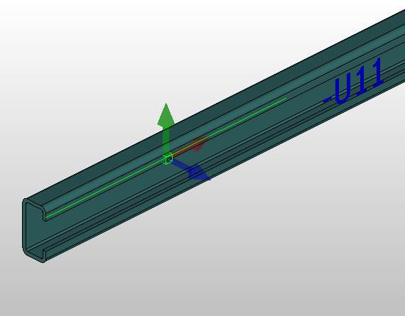
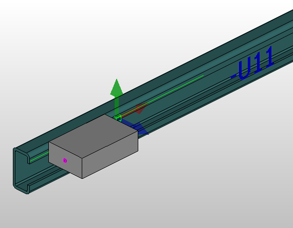

# Определить линию монтажа

С помощью линий монтажа можно размещать трехмерные объекты на функциональных элементах с неизменяемой длиной, например профильных C-шинах, так же, как и на несущих шинах. Для линий монтажа предусмотрена возможность выравнивания. Таким образом, линии монтажа также можно использовать для размещения трехмерных объектов на косых поверхностях или в неортогональном положении установки.

Линии монтажа копируют [Направление Z](cabinetgui_h_anschlussdefinieren.md) поверхности, выбранной в ходе определения. Направление Z указывает, как должен быть направлен размещаемый на линии монтажа объект.

Условия:

* Вы открыли проект.
* Навигатор пространства листа открыт, и одно пространство листа открыто.
* Пространство листа содержит трехмерный объект.
* Включен захват объекта.

1. Выберите пункты меню Обработать > Логика устройства > Линия монтажа.
2. Переместите курсор на 3D-объекты.

!!! info "Для сведения:"

    Точки, края и поверхности, находящиеся под курсором, автоматически выделяются светлым. Отображаются точки захвата.

3. Выберите поверхность, ось Z которой должна определять выравнивание линии монтажа.
4. Укажите начальную и конечную точки линии монтажа на требуемой поверхности или ребре.

!!! info "Для сведения:"

    Выравнивание линии монтажа отображается с помощью координатного перекрестия.

5. В диалоговом окне Свойства занесите нужные значения в поля Имя и Описание.
6. Щелкните по кнопке ++OK++.

!!! info "Для сведения:"

    Трехмерные объекты, например скобы для крепления кабеля, можно размещать по всей длине линии монтажа в выбранном выравнивании.

!!! tip "Совет:"

    * Для последующего выравнивания и поворота линии монтажа воспользуйтесь функцией [Повернуть вокруг оси](cabinetgui_h_drehenxyz.md).
    * Линии монтажа можно перемещать в проектах макросов как графические элементы с помощью пункта меню Обработать > Переместить или перетаскивания мышью.

**См. также:**

* [Отображение инструмента для монтажных работ](cabinetgui_h_montagehilfenanzeigen.md)
