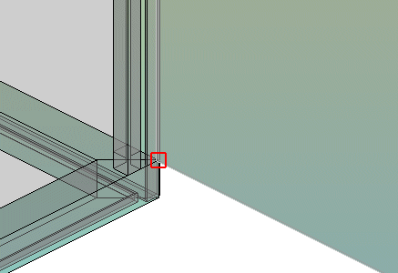

# Разместить монтажные платы

Условия:

* Вы открыли проект.
* Навигатор пространства листов открыт, и одно пространство листов открыто.

### Разместить монтажную плату из базы данных изделий

1. Выберите пункты меню Вставить > Монтажная плата.
2. В диалоговом окне Выбор изделия выделите требуемое изделие монтажной платы.
3. Щелкните по кнопке ++OK++.

!!! info "Для сведения:"

    Рядом с курсором в области предварительного просмотра появится прозрачное изображение монтажной платы в размере, заданном для данного изделия. Четыре возможные точки захвата будут отмечены квадратами серого цвета. Текущая точка захвата находится слева внизу и выделена красным цветом.

4. С помощью клавиши ++A++ можно переключать точку захвата.

!!! info "Для сведения:"

    При каждом нажатии клавиши ++A++ точка захвата перемещается по часовой стрелке от положения "слева внизу" к положениям "слева вверху", "справа вверху", "справа внизу".

5. Выберите пункт всплывающего меню Опции размещения, чтобы открыть диалоговое окно [Опции размещения](cabinetgui_d_platzieroptionen.md). Здесь можно задать смещение точки захвата относительно позиции курсора, а также использовать все возможности настроек для многократного размещения монтажных плат.
6. Щелчком мыши вставьте монтажную плату в требуемом месте.
7. Чтобы разместить монтажную плату в профиле электрошкафа или на второй монтажной плате, ее следует перенести в область рядом с одной из угловых точек второй монтажной платы или профиля шкафа.

!!! info "Для сведения:"

    В угловой точке появится красный символ трехмерной точки захвата. Размещаемая монтажная плата будет захвачена в этой точке и размещена в ней щелчком мыши.

### Разместить свободную монтажную плату

В целях простого и быстрого проектирования была реализована возможность размещения в пространстве листа отдельных монтажных плат без окружающего профиля шкафа и без выбора в базе данных изделий. Свойства произвольных монтажных плат и возможности их обработки не отличаются от монтажных плат, привязанных к изделиям. Позднее при помощи функции выбора изделия монтажной плате можно присвоить изделие.

1. Выберите пункт меню Вставить > Произвольная монтажная плата.
2. В диалоговом окне Произвольная монтажная плата в полях Ширина, Высота и Глубина введите значения произвольной монтажной платы или подтвердите предложенные значения. Значения размеров не должны оставаться пустыми, иначе размещение произвольной монтажной платы будет невозможно.
3. Щелкните по кнопке ++OK++.
4. Разместите произвольную монтажную плату таким же образом, как и монтажные платы из базы данных изделий.
