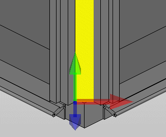

# Определить и использовать монтажную сетку

Монтажные сетки присваиваются отдельным поверхностям трехмерного размещения изделия и при размещении других компонентов отображаются на этих поверхностях. Таким образом, размещение возможно теперь только в точках пересечения линий сетки. Монтажная сетка позволяет увидеть, например, на профилях электрошкафа образцы отверстий, специфических для производителя и типа, внутри которых при монтаже будет выполняться резьбовое соединение. Свойства размещенной монтажной сетки можно изменять позднее.

Условия:

* Вы открыли проект.
* Навигатор пространства листа открыт, и открыто пространство листа.
* Пространство листа содержит импортированные трехмерные тела, которые необходимо сохранить в виде электрошкафа или принадлежности.

1. Выберите пункты меню Обработать > Логика устройства > Монтажная сетка.
2. В диалоговом окне Монтажная сетка введите подходящие значения для интервалов сетки и рядов сетки в направлениях X и Y.
3. Щелкните по кнопке ++OK++.Инструменты для монтажных работ, например точки захвата, точки монтажа, монтажные поверхности и т. д., являются элементами логики устройств.
4. Переместите курсор над площадью трехмерной геометрии.

!!! info "Для сведения:"

    Расположенная под курсором площадь будет автоматически выделена цветом.

!!! info "Для сведения:"

    Нулевая точка площади, к которой относятся определенные в диалоговом окне Монтажная сетка точки сетки, отображается с системой координат.

5. Щелкните по нужной площади.

!!! info "Для сведения:"

    Монтажная сетка отображается на курсоре с возможностью свободного перемещения.

!!! info "Для сведения:"

    На выбранной площади и на размещаемой монтажной сетке отображаются точки захвата.

6. Переключайте при необходимости во время размещения при помощи кнопки ++A++ точку захвата или используйте для этого контекстное меню Опции размещения, чтобы указать через одноименное диалоговое окно точку захвата, а также смещение для выбранной точки захвата относительно позиции курсора.
7. Разместите монтажную сетку щелчком по нужной позиции на выбранной площади.

!!! info "Для сведения:"

    Монтажная сетка сохраняется в размещении изделия и отображается в пространстве листа на выбранной площади. Функция остается активной, и остальные площади можно снабдить монтажными сетками.

!!! info "Для сведения:"

    Для однорядной монтажной сетки отображаются маленькие поперечные линии.

8. Завершите операцию, выбрав пункт всплывающего меню Прервать операцию или нажав клавишу ++Esc++.
9. Щелкните дважды на размещенной монтажной сетке и укажите на первой вкладке диалогового окна Свойства: монтажная сетка информативное имя и описание.
10. Если затем вы захотите изменить интервал сетки и / или количество рядов сетки в направлениях X и Y, укажите на вкладке Формат диалогового окна необходимые значения.
11. Щелкните по кнопке ++OK++.

Чтобы использовать монтажную сетку, определенную на монтажной поверхности или профиле, при размещении функционального элемента, захват монтажной сетки может быть включен и выключен во время процесса размещения через всплывающее меню.

Условие:

На монтажной поверхности или профиле была определена монтажная сетка.

1. Во время размещения элементов выберите пункт всплывающего меню Захват монтажной сетки.

!!! info "Для сведения:"

    Функциональный элемент можно оптимально разместить на точках пересечения линий монтажной сетки.

2. Если вы хотите снова свободно размещать элементы на всей монтажной поверхности, а не на монтажной сетке, выберите пункт всплывающего меню Захват монтажной поверхности.

**См. также:**

* [Диалоговое окно Монтажная сетка](ged3dmateeditorgui_d_montageraster.md)
