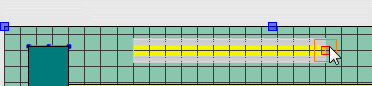
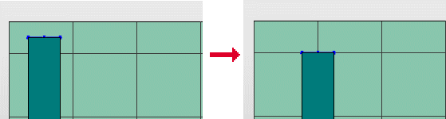

# Работа с сетками в пространстве листа

Чтобы упростить позиционирование трехмерных размещений изделий в пространстве листа, можно также использовать сетку. При это точки вставки и точки элементов позиционируются по точкам сетки. При работе в трехмерном пространстве листа во время позиционирования трехмерных размещений изделий отображается сетка, состоящая из линий. В этом случае точки вставки лежат на точках дуг окружностей линий.

В пользовательских настройках можно сохранить пять различных размеров сетки; потом их можно выбрать в пространстве листа с помощью кнопок  и  на панели инструментов Вид или через меню Обработать > Другое > Сетка A - E. Настройка возможна для 2D и 3D раздельно.

Условие:

Вы открыли пространство листа.

### Использовать захват растра

Использование захвата сетки не зависит от ее отображения.

1. Чтобы включить или выключить захват сетки, выберите пункты меню Параметры > Захват сетки.

!!! info "Для сведения:"

    Если активирована функция захвата сетки, то все следующие действия выполняются в точках пересечения линий сетки.

### Выровнять по сетке

Эта функция используется для последующего выравнивания по настройкам сетки тех трехмерных объектов, которые были размещены без ее использования. Для этого не имеет значения, включен или выключен захват сетки.

1. Выделите эти объекты и выберите пункты меню Обработать > Другое > Выровнять по сетке.

!!! info "Для сведения:"

    Выбранные объекты выравниваются заново (т. е. перемещаются) таким образом, чтобы все их важные точки (например, точка захвата, точка размещения) находились на сетке.

**См. также:**

* [Диалоговое окно Настройки: 3D (Пользователь, Графическая обработка)](gedviewer_d_einstellungenbenutzerallgemein3d.md)
