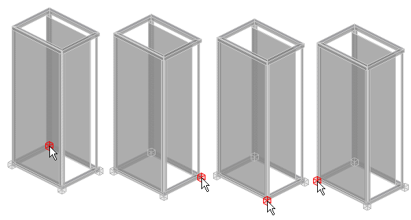
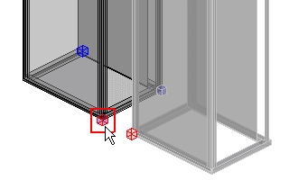

# Разместить электрошкафы

На трехмерном чертеже монтажных поверхностей электрошкафы размещаются в пространстве листа. В базе данных изделий определены различные серии электрошкафов, из которых можно выбрать электрошкафы для размещения. Существует два типа электрошкафов, определенных в базе данных изделий в отдельных подгруппах продуктов. В шкафах обоих типов элементы сгруппированы и зафиксированы в электрошкафу при помощи свойства Функциональный элемент привязан к вышестоящему функциональному элементу.

* Тип "Шкаф": Электрошкаф состоит из нескольких трехмерных тел (корпус, дверь, монтажная плата). Корпус представляет собой единое трехмерное тело. Отдельные элементы можно удалить в навигаторе пространства листа. К типу электрошкафов "Шкаф" относятся электрошкафы серий AE и CM.
* Тип "Отдельная часть": Электрошкаф состоит из нескольких трехмерных тел (профили, стены, двери, монтажные платы). Все элементы электрошкафа можно удалять по отдельности в навигаторе пространства листа. К типу электрошкафов "Отдельная деталь" относятся электрошкафы серии TS 8.

Условия:

* Вы открыли проект.
* Навигатор пространства листов открыт, и одно пространство листов открыто.

1. Выберите пункт меню Вставить > Электрошкаф.
2. В диалоговом окне Выбор изделия выделите требуемое изделие шкафа.
3. Щелкните по кнопке ++OK++.

!!! info "Для сведения:"

    Электрошкаф появится рядом с курсором в виде подробного предварительного просмотра с указанными в изделии высотой, шириной и глубиной. Выбранная в текущий момент точка захвата выделена красным цветом и дополнительно отмечена красным квадратом.

4. С помощью клавиши ++A++ можно переключать точку захвата.

!!! info "Для сведения:"

    При нажатии клавиши ++A++ точка захвата перемещается от положения "сзади слева" к положениям "сзади справа", "спереди справа" и "спереди слева".

5. Выберите пункт всплывающего меню Опции размещения, чтобы открыть диалоговое окно [Опции размещения](cabinetgui_d_platzieroptionen.md). Здесь можно задать смещение точки захвата относительно позиции курсора, а также использовать все возможности настроек для многократного размещения электрошкафов.

6. Разместите шкаф, щелкнув мышью в нужном месте.

!!! info "Для сведения:"

    Электрошкаф будет вставлен. В навигаторе автоматически появится идентификатор группирования "S<Номер электрошкафа>", который будет перенесен на все отдельные детали электрошкафа и все размещенные в этом электрошкафу компоненты. Все размещенные в электрошкафу функциональные элементы логически сгруппированы. При перемещении электрошкафа или функционального элемента шкафа перемещаются и все размещенные на нем компоненты. В дальнейшем выбранное изделие будет прикреплено к курсору и сможет менять положение.
