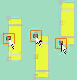

# Разместить функциональные элементы с переменной длиной

Функциональные элементы с переменной длиной — это:

* Несущие шины
* Кабельные каналы
* Профильные С-шины
* Пользовательские шины.

Как правило, функциональные элементы с переменной длиной размещаются на монтажных платах или монтажных поверхностях профилей шкафов. Если на изделии сохранена соответствующая схема сверления, при размещении функциональных элементов с переменной длиной автоматически генерируются монтажные отверстия. Если из-за настроек схемы сверления одно из этих монтажных отверстий полностью или частично расположено в запретной зоне для сверления, автоматически генерируется альтернативное монтажное отверстие вне запретной зоны для сверления.

Для поддержки точного размещения предусмотрены возможности [автоматической активации](cabinetgui_h_aktivierenautomatisch.md) или [прямой активации](cabinetgui_h_aktivierenautomatisch.md). Перед размещением точку захвата функционального элемента с переменной длиной можно переместить. Функциональные элементы с переменной длиной можно вставлять двумя различными способами, отличающимися методом указания длины:

* Размещение осуществляется указанием начальной и конечной точек; при этом длина определяется интервалом между этими точками.
* Копирование длины уже размещенного функционального элемента; при этом функциональный элемент с переменной длиной размещается при вводе отдельной точки.

Второй способ позволяет автоматически располагать функциональный элемент с переменной длиной по центру между двумя уже размещенными функциональными элементами.

Условия:

* Вы открыли проект.
* Навигатор пространства листа открыт, и открыто пространство листа.

1. Выберите один из пунктов меню Вставить > Несущая шина / Кабельный канал / Профильная C-шина / Пользовательская шина.
2. В диалоговом окне Выбор изделия выделите требуемое изделие функционального элемента.
3. Щелкните по кнопке ++OK++.

!!! info "Для сведения:"

    Рядом с курсором в области предварительного просмотра появится прозрачное изображение функционального элемента с переменной длиной и высотой, заданной для данного изделия, но без определенной длины. Выбранная в текущий момент точка захвата выделена красным цветом и дополнительно отмечена красным квадратом.

4. С помощью клавиши ++A++ можно переключать точку захвата.

!!! info "Для сведения:"

    При нажатии клавиши ++A++ точка захвата перемещается из положения "в центре" в положения "вверху" и "внизу".

5. Выберите пункт всплывающего меню Опции размещения, чтобы открыть диалоговое окно [Опции размещения](cabinetgui_d_platzieroptionen.md). Здесь можно выбрать точку захвата и ввести коэффициент смещения.
6. Укажите начальную точку функционального элемента с переменной длиной в требуемом месте.
7. Переместите курсор вправо, влево, вверх или вниз и растяните функциональный элемент с переменной длиной как линию до необходимой длины.

!!! info "Для сведения:"

    Функциональный элемент будет отображен в прозрачном представлении с текущей длиной до позиции курсора.

8. Укажите конечную точку функционального элемента в требуемом месте.

!!! info "Для сведения:"

    Вставляется функциональный элемент. В дальнейшем выбранное изделие будет прикреплено к курсору и сможет менять положение.

!!! tip "Совет:"

    Если поочередно щелкнуть по двум любым геометрическим точкам, удерживая клавишу ++Ctrl++, в центре между ними появится точка захвата, начальная или конечная точка. Этот способ ввода можно использовать, например, для размещения точки в центре отверстия.

Условие:

На данной монтажной поверхности уже имеется минимум один функциональный элемент с переменной длиной.

1. Вставить > Несущая шина / Кабельный канал / Профильная C-шина / Пользовательская шина
2. В диалоговом окне Выбор изделия выберите требуемое изделие функционального элемента. Щелкните по кнопке ++OK++.
3. Измените точку захвата как при размещении с переменной длиной.
4. Выберите пункт всплывающего меню Копировать длину.
5. Щелкните по уже размещенному функциональному элементу с переменной длиной.

!!! info "Для сведения:"

    Новый размещаемый функциональный элемент примет длину выбранного размещенного функционального элемента и будет закреплен на курсоре. Размещаемый функциональный элемент нужно перемещать вместе с курсором только параллельно выбранному функциональному элементу.

6. Переместите функциональный элемент параллельно до требуемого места и разместите его щелчком мыши.

Условие:

На данной монтажной поверхности уже имеется минимум два функциональных элемента с переменной длиной.

1. Вставить > Несущая шина / Кабельный канал / Профильная C-шина / Пользовательская шина
2. В диалоговом окне Выбор изделия выберите требуемое изделие функционального элемента. Щелкните по кнопке ++OK++.
3. Выберите пункт всплывающего меню Копировать длину.
4. Щелкните по уже размещенному функциональному элементу с переменной длиной.

!!! info "Для сведения:"

    Новый размещаемый функциональный элемент примет длину выбранного размещенного функционального элемента и будет закреплен на курсоре.

5. Выберите пункт всплывающего меню Размещение по центру.
6. Щелкните ***левой кнопкой мыши*** по второму размещенному функциональному элементу.

!!! info "Для сведения:"

    Новый размещаемый функциональный элемент будет размещен по центру между двумя выбранными компонентами.

**См. также:**

* [Активировать монтажные поверхности](cabinetgui_h_aktivierenautomatisch.md)
* [Системы сборных шин ](cabinetgui_k_sammelschienensystem.md)
