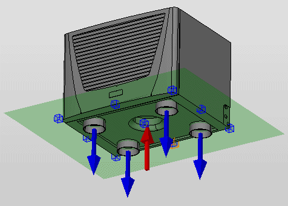
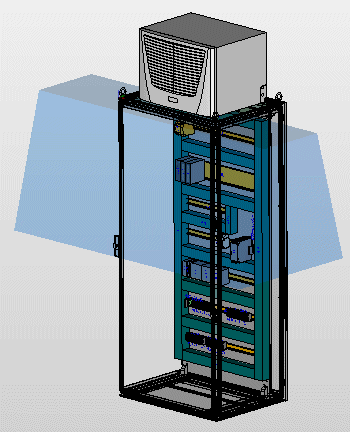
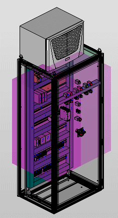
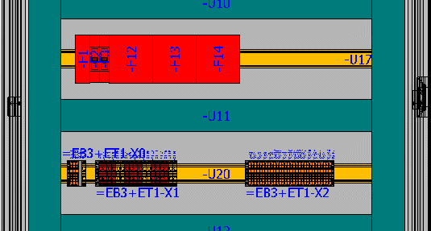

# Виды для теплового расчета

Специальные виды отображения, используемые для "Теплового расчета", являются вспомогательным средством при разработке проектировщиком установок максимально эффективного решения в области кондиционирования. Эти виды отображаются только при размещениях изделий, которые основываются на данных изделий производителя Rittal и поступили через EPLAN Data Portal:

* Направления движения воздуха
* Области оптимального кондиционирования
* Зарезервированные зоны для воздушного потока
* Распределение тепловыделения

Вид отображения "Распределение тепловыделения" доступен для всех устройств и клемм, если свойство изделия Макс. мощность потерь содержит соответствующее значение. Другие виды, наоборот, отображаются только при наличии компонентов системы кондиционирования Rittal.

Все виды включаются и выключаются в меню Вид > Тепловой расчет.

!!! note "Замечание:"

    Функции Направление движения воздуха, Области оптимального кондиционирования и Зарезервированные зоны для воздушного потока можно использовать только с расширенными данными изделий, которые можно получить у производителя Rittal через EPLAN Data Portal.

При монтаже компонентов системы кондиционирования особое внимание уделяется типу и направлению потоков воздуха:

* Струя холодного воздуха не должна быть направлена непосредственно на работающие компоненты.
* Потоки воздуха системы кондиционирования не должны быть направлены против воздушной струи самоохлаждающихся компонентов.

Для соблюдения этих требований при планировании системы кондиционирования можно обозначать направление движения холодного и теплого потоков воздуха к соответствующим компонентам системы с помощью ***стрелок направления движения воздуха***. На соответствующих входных или выходных отверстиях системы стрелки направления движения воздуха указывают тип и направление потока входящего или выходящего воздуха:

* Направление холодного воздуха (синяя стрелка)
* Направление теплого воздуха (красная стрелка).

Если макросы изделий с направлениями движения воздуха размещаются при проектировании в пространстве листа, то направления движения воздуха могут отображаться.

Представление направлений движения воздуха зависит от наличия принадлежностей для подачи воздуха (напр., воздушный канал или защитные крышки). Если такие принадлежности размещены в проточном канале, стрелка, указывающая направление движения воздуха, отображается не на главном изделии, а на принадлежности.

Область оптимального кондиционирования — это пространство, в котором кондиционер благодаря своей мощности подачи воздуха может создавать оптимальные климатические условия. На размещенных макросах изделий области оптимального кондиционирования можно отображать в пространстве листа. Определяющим фактором при растягивании области оптимального кондиционирования является т. н. "дальность выброса" холодного воздуха компонента системы кондиционирования. В этой области в первую очередь следует расположить компоненты, вырабатывающие отходящее тепло.

Зарезервированные зоны для воздушного потока на изделии определяются производителем данных изделия. Каждому направлению движения воздуха присвоена одна зарезервированная зона. Под зарезервированными зонами понимаются области, которые для получения максимального эффекта кондиционирования должны быть свободны от каких-либо препятствий. Представление зарезервированных зон изменяется в зависимости от размещения принадлежностей для подачи воздуха (напр., воздушный канал или защитные крышки).

Вследствие неправильно распределенных функциональных элементов в электрошкафу могут возникать наиболее горячие места. Чтобы обозначить потенциальные наиболее горячие места уже на этапе проектирования, следует указать их путем присвоения соответствующего цвета размещениям изделий в 5 различных тонах. Фактором, релевантным для их обозначения, является распределение тепловыделения одного компонента. Распределение тепловыделения определяется отношением свойства изделия Макс. мощность потерь одного компонента к поверхности его размещения. Оно рассчитывается автоматически при наличии соответствующих свойств (напр., мощности потерь устройства).

!!! note "Замечание:"

    Вводите все данные о мощности потерь в следующей форме: значение и единица измерения в ваттах, например "10Вт".

    При этом обязательно указывайте единицу измерения. Возможно использование пробела, например "10 Вт".
