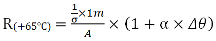
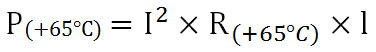

# Расчет общей мощности потерь на распределительных устройствах: Принцип

Расчет общей мощности потерь осуществляется на основе следующих характеристик и методик расчета:

### Тепловой расчет

Основой для расчета мощности потерь служит определение рамочных условий для каждого проекта или для каждого электрошкафа, причем в ***Rittal Therm*** учитываются следующие факторы:

* Ситуация установки
* Температурная область
* Напряжение
* частота.

Для "Теплового расчета" в EPLAN требуется наличие следующих факторов:

* Температурная область
* Общая мощность потерь
* Коэффициент одновременности
* Максимально допустимая мощность потерь на компонентах
* Номинальная сила тока (шины).

Все факторы для определения рамочных условий представляют собой свойства изделий или размещений изделий, значения которых пользователь должен правильно задать при проектировании.

### Расчет мощности потерь устройств и сборных шин

Для расчета мощности потерь отдельных устройств и сборных шин производится оценка специфических свойств изделий. Управление свойствами изделия осуществляется в базе данных изделий EPLAN. Речь при этом идет о данных производителей компонентов и данных, созданных и настроенных пользователем. Правильность этих данных EPLAN Software & Service не гарантирует.

Устройства

Расчет мощности потерь устройства осуществляется по формуле:

***фактическая мощность потерь устройства = мощность потерь x коэффициент одновременности***

* ***Мощность потерь*** устройства считывается из свойства изделия Макс. мощность потерь.
* ***Коэффициент одновременности*** (стандартное значение = 0) устанавливается для проекта в качестве фактора посредством свойства проекта Тепловой расчет: Коэффициент одновременности. Это оценочное значение, которое учитывает тот факт, что в установке никогда не бывают одновременно включены все устройства на полную мощность. На каждом устройстве может быть установлен свой коэффициент одновременности. Коэффициент одновременности сохраняется на функциях в свойстве Тепловой расчет: Коэффициент одновременности (автоматически).

Результат расчета сохраняется в свойстве Тепловой расчет: Мощность потерь устройства.

Сборные шины

Для расчета мощности потерь шины анализируются следующие свойства изделия, которые можно найти на вкладке Сборная шина:

* Поперечное сечение шины в мм²;
* Материал шины (медь / алюминий / другой материал);
* Удельная электрическая проводимость при +20 °C
* Температурный коэффициент.

!!! note "Замечание:"

    * Температурный коэффициент действует только при температуре 20 °C.
    * Расчет мощности потерь шины осуществляется при средней температуре шины 65 °C.

Для расчета мощности потерь шины в ваттах [Вт] требуются следующие факторы:

* ***Рабочий ток шины*** в амперах [A] (из свойства изделия Тепловой расчет: Рабочий ток шины)
* ***Сопротивление шины*** в омах [Ω] на один метр сборной шины при температуре шины +65 °C; рассчитывается автоматически из значений свойств изделия Поперечное сечение шины, Удельная электрическая проводимость при +20 °C и Температурный коэффициент, а также разность температур Δθ [K] = 45 K.

Формула расчета:

Условные обозначения в формуле:

A = поперечное сечение шины в [мм²];
σ = удельная электрическая проводимость в [МСм/м] (= мегасименс на метр) или ++м/(Ω x мм²)++;
α = температурный коэффициент в [1/K];
* ***длина шины*** в метрах [м] (из свойства ссылки изделия Подмножество / длина в единицах измерения проекта).

Мощность потерь шины рассчитывается по следующей формуле и заносится в свойство Тепловой расчет: Мощность потерь устройства:

Условные обозначения в формуле:

I² = рабочий ток шины в [A];
R(+65 °C) = сопротивление шины в [Ω];
l = длина шины в [м].

### Общая мощность потерь

Для расчета общей мощности потерь используются значения мощности потерь установленных устройств и систем сборных шин для каждой температурной области. Результат расчета общей мощности потерь заносится в свойство проекта Тепловой расчет: Общая мощность потерь для климатической области [n], где "n" обозначает номер температурной области.

**См. также:**

* [Расчет общей мощности потерь на распределительных устройствах](cabinetgui_k_verlustleistung.md)
* [Рассчитать общую мощность потерь на распределительных устройствах](cabinetgui_h_verlustleistungberechnen.md)
* [Диалоговое окно "Рассчитать мощность потерь"](cabinetgui_d_verlustleistungberechnen.md)
